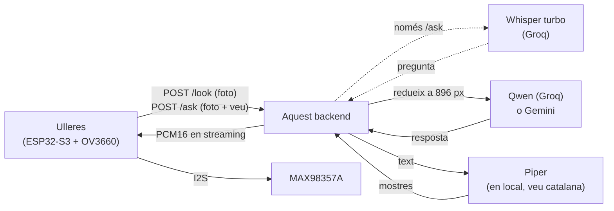
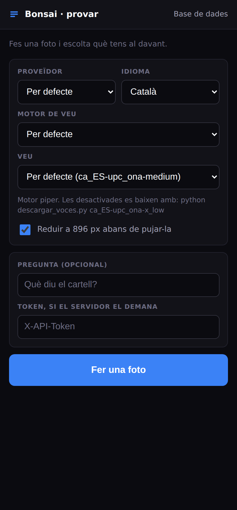
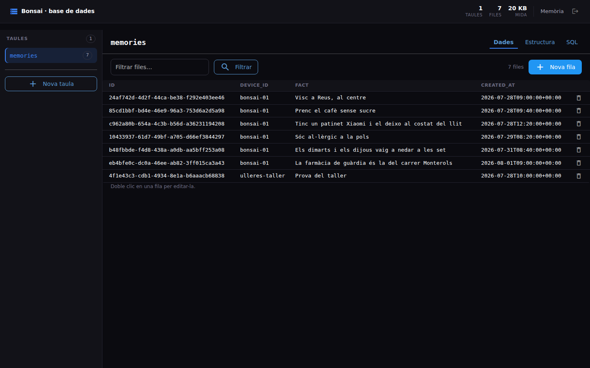
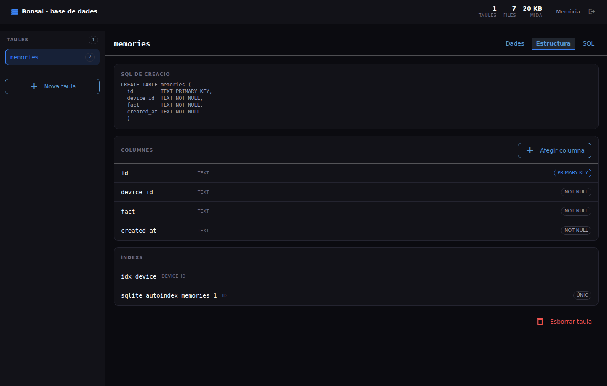
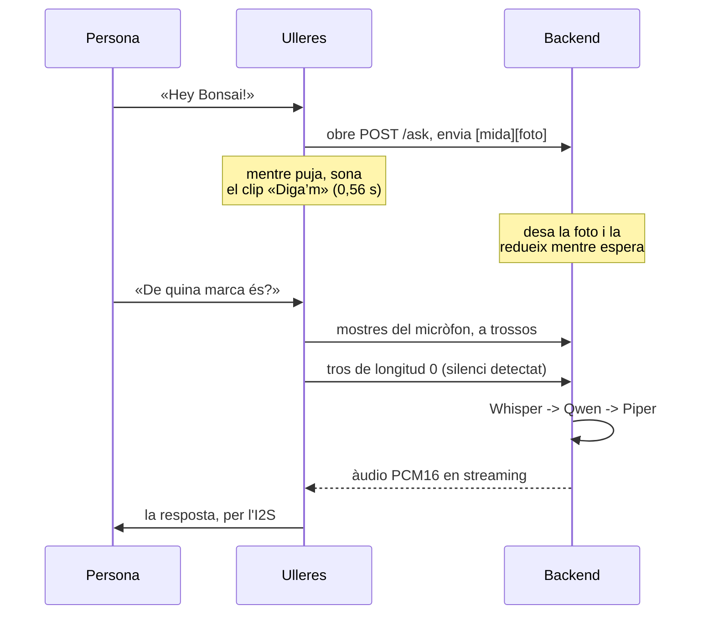

# Bonsai Backend

Backend de **Bonsai**, unes ulleres intel·ligents que expliquen en veu alta què
tens al davant: per orientar-te, per llegir un cartell o un menú, per saber què
és un objecte o simplement per curiositat.



**L'ESP32 crida l'API directament**, sense cap aplicació web al mig. Per això
els dos endpoints d'imatge estan fets a mida del microcontrolador: reben la
foto i tornen l'àudio en cru i en streaming, llest per a l'I2S.

- **`/look`** — foto (i una pregunta escrita, si de cas) → resposta parlada.
- **`/ask`** — foto **i la pregunta dita en veu alta**. Es transcriu amb
  Whisper turbo a Groq i la frase passa a ser la pregunta. Una sola petició.

Les peces:

- **Veu a text**: **Whisper turbo** a Groq, només per a `/ask`. Es factura per
  segons d'àudio, no per tokens: no toca la quota de les fotos.
- **Visió**: **Groq** per defecte (552 ms, molt regular, quota justa) o
  **Gemini** (més lent, quota molt més folgada per desenvolupar).
- **Veu**: **Piper** en local per defecte (205 ms, veu catalana
  `ca_ES-upc_ona-medium`, sense xarxa). edge-tts disponible com a alternativa.
- **Memòria**: SQLite, un fitxer, sense serveis externs.

Amb la configuració per defecte, el **primer byte d'àudio surt a ~1,0-1,8 s**
des que arriba la foto. Totes les xifres d'aquest README estan mesurades, no
estimades — el detall i el perquè de cada decisió és a
**[docs/BENCHMARKS.md](docs/BENCHMARKS.md)**.

---

## Dues pàgines, per provar-ho i per administrar-ho

Les serveix el mateix backend, sense dependències ni CORS, i comparteixen
aspecte: negre i blau.

**[`/provar`](static/probar.html)** — fes una foto des del mòbil i escolta la
resposta. Redueix la imatge abans de pujar-la i ensenya el desglossament de
temps.



**`/admin`** — explorar qualsevol taula, crear-ne, afegir columnes, editar
files i executar SQL a mà. També és per on es toquen els records: la taula
`memories`.





Això és **accés SQL complet a la base de dades**, així que la ruta només
existeix si defineixes `ADMIN_PASSWORD`:

```bash
openssl rand -hex 16        # i posa-la a .env com a ADMIN_PASSWORD
```

Sense la variable, `/admin` no es munta i torna 404. Amb ella, demana la
contrasenya abans de deixar veure res.

---

## Provar-ho en local

Necessites **Python 3.11+** i una clau gratuïta de
[console.groq.com](https://console.groq.com) (o de
[aistudio.google.com/apikey](https://aistudio.google.com/apikey) per Gemini).
La veu no necessita cap clau: Piper és local i es baixa sol (63 MB) la primera
vegada.

```bash
git clone https://github.com/devvazquez/bonsai-backend.git
cd bonsai-backend
./run-local.sh          # Windows: .\run-local.ps1
```

El primer cop crea el `.env` i s'atura perquè hi posis la `GROQ_API_KEY`. El
tornes a executar i arrenca amb recàrrega automàtica.

- API: <http://127.0.0.1:8080> · Swagger: `/docs`
- Provar amb una foto: `/provar`
- Administrar la base de dades: `/admin` (només amb `ADMIN_PASSWORD` definida)
- `/health` diu quin proveïdor hi ha actiu i si Piper ha carregat bé

<details>
<summary>Arrencar-ho a mà, sense l'script</summary>

```bash
python -m venv .venv && source .venv/bin/activate   # Windows: .venv\Scripts\Activate.ps1
pip install -r requirements.txt
cp .env.example .env          # i posa-hi la teva GROQ_API_KEY
uvicorn main:app --host 127.0.0.1 --port 8080 --reload
```
</details>

<details>
<summary>Terminal de proves (test_bonsai.py), sense dependències</summary>

```bash
python test_bonsai.py
```

```
bonsai> describe image.png              # imatge -> text -> àudio, amb temps
bonsai> speak Hola, les ulleres funcionen
bonsai> remember Al Biel li agrada el cafè sense sucre
bonsai> config provider gemini          # canviar de proveïdor sense reiniciar
bonsai> help
```
</details>

---

## API

| Mètode | Ruta | Descripció |
| --- | --- | --- |
| `POST` | `/look` | **Endpoint principal**: foto → àudio en cru i en streaming |
| `POST` | `/ask` | Foto + pregunta dita en veu alta → àudio. Transcriu amb Whisper |
| `POST` | `/speak?text=...&lang=ca` | Només text a veu |
| `GET`/`POST` | `/memory` | Dispositius i records |
| `PATCH`/`DELETE` | `/memory/{deviceId}/{id}` | Corregeix o esborra un record |
| `GET` | `/voices?prefix=ca` | Veus disponibles |
| `GET` | `/health` | Estat del servei. Sense autenticació |
| `GET` | `/admin` | Panell de la base de dades. Amb `ADMIN_PASSWORD` |

### `POST /look`

```jsonc
{
  "image": "<base64 sense el prefix data:image/...>",
  "deviceId": "bonsai-01",
  "prompt": "Què diu el cartell?",     // opcional; per defecte, descripció general
  "lang": "ca",                        // ca | es | en
  "provider": "groq",                  // groq | gemini. Per defecte, VISION_PROVIDER
  "tts": "piper",                      // piper | edge. Per defecte, TTS_PROVIDER
  "audioFormat": "pcm16",              // pcm16 | mulaw | wav, o mp3 amb edge
  "sampleRate": 16000                  // 8000 | 16000 | 22050
}
```

**El cos de la resposta és l'àudio**, en cru i en streaming. Tot el context va
a capçaleres (el text en base64, perquè les capçaleres HTTP són ASCII):

```
X-Bonsai-Text: <base64>        X-Bonsai-Provider: groq
X-Bonsai-Format: pcm16         X-Bonsai-Rate: 16000
X-Bonsai-Vision-Ms: 552        X-Bonsai-Resize-Ms: 192
```

Des d'un navegador, `"audioFormat": "wav"` (es posa directe a un `<audio>`).
Des de l'ESP32, `pcm16` a 16 kHz: enters de 16 bits amb signe, little-endian,
mono — exactament el que vol l'I2S del MAX98357A, sense conversió. Amb
`"tts": "edge"` el format només pot ser `mp3`.

| Codi | Vol dir |
| --- | --- |
| `429` | Quota esgotada. Ve amb `Retry-After` en segons: reintenta, no és una errada |
| `502` | El proveïdor ha fallat de debò; el detall va al cos |
| `500` | Falta la clau del proveïdor triat |
| `400` | Paràmetres invàlids (`provider`, `tts`, `audioFormat`...) |

### `POST /ask`

Igual que `/look`, però la pregunta va dita en veu alta en comptes d'escrita.
El cos va **en cru, sense JSON ni base64**, amb aquesta forma:

```
4 bytes   uint32 big-endian   quants bytes ocupa la foto
N bytes   la foto (JPEG)
la resta  l'àudio del micròfon, fins que es tanca la petició
```

Es llegeix a mesura que arriba: la foto es guarda en quant està sencera,
mentre la persona encara està parlant. Per això l'àudio va en streaming — la
pujada se solapa amb la frase en comptes d'anar-hi al darrere.

L'àudio pot ser **PCM16 mono en cru** —el que surt del micròfon PDM de la XIAO
ESP32-S3 Sense llegit per I2S; digues a quina freqüència amb `micRate`— o un
fitxer amb capçalera (WAV, OGG, m4a, MP3): es detecta sol.

El cos es pot enviar **en trossos, amb `Transfer-Encoding: chunked` i sense
`Content-Length`**, que és el que fa el firmware.

#### Com encaixa amb les ulleres



Aquest encavalcament és el que fa que sembli ràpid, i el backend hi juga:

- **La foto es desa als 10 ms**, no al final. Comprovat amb sockets a pelo
  (`test_chunked.py`), tres segons abans que la persona acabi de parlar.
- **La foto es redueix mentre s'espera el micròfon**, en un fil a part. Amb una
  de 12 MP són 703 ms de CPU que abans anaven al camí crític i ara ja estan
  fets quan arriba la pregunta. Ho pots veure a `X-Bonsai-Resize-Wait-Ms`: és
  el que ha calgut esperar-la de debò, i normalment és 0.
- **La pausa entre la foto i la primera mostra no molesta.** Hi caben el clip
  del «Diga’m» i el que la persona trigui a arrancar. El límit és
  `ASK_SILENCE_TIMEOUT_SECONDS` (15 s per defecte) i és **per tros**, no total:
  si el micròfon emmudeix del tot, `408` i es tanca la connexió en comptes de
  quedar-se penjada.

Compte amb què **no** se solapa: la transcripció. Whisper necessita l'àudio
sencer, o sigui que no comença fins que tanques el cos. El que t'estalvies és
pujar la foto i les mostres, que amb WiFi no és poc.

#### El clip del «Diga’m»

Que surti de la mateixa veu que les respostes: el genera el propi backend.

```bash
curl -X POST "$API/speak?text=Diga%E2%80%99m!&audioFormat=pcm16&sampleRate=16000" \
     -o digam.pcm      # 17,8 KB, 0,56 s, llest per escriure a l'I2S
```

I que el text coincideixi amb el que se li diu al model: els dos torns del
preàmbul es configuren amb `ASK_WAKE_PHRASE` i `ASK_WAKE_REPLY`. Si canvies el
clip de les ulleres i no les canvies, li estaràs explicant al model una
conversa que no ha passat.

Els paràmetres van a la query: `deviceId`, `lang`, `provider`, `tts`,
`audioFormat`, `sampleRate`, `micRate` (per defecte 16000) i `maxSide`.

```bash
# Provar-ho des del portàtil amb un WAV qualsevol
python - <<'EOF' > cos.bin
import struct, sys
foto = open("foto.jpg", "rb").read()
sys.stdout.buffer.write(struct.pack(">I", len(foto)) + foto + open("veu.wav", "rb").read())
EOF
curl -X POST "http://127.0.0.1:8080/ask?deviceId=proves&audioFormat=wav" \
     --data-binary @cos.bin -D capçaleres.txt -o resposta.wav
```

La resposta és la mateixa que la de `/look` i, a més:

```
X-Bonsai-Transcript: <base64>   X-Bonsai-Stt-Ms: 380
X-Bonsai-Audio-Secs: 2.10       X-Bonsai-Capture-Id: <uuid>
```

Abans de la foto i la pregunta se li donen per dits dos torns de conversa —
`user: Hey Bonsai!` i `assistant: Diga'm!` — perquè el model contesti com qui
continua una conversa i no com qui rep una ordre solta.

Cada petició deixa la foto a `captures/` i una fila a la taula `captures`
(què es va dir, què es va respondre i els temps), visible a `/admin`. Se'n
conserven les 100 últimes per dispositiu; les velles es borren amb el fitxer.

| Codi | Vol dir |
| --- | --- |
| `400` | La trama està mal formada, o amb prou feines hi ha àudio |
| `408` | El micròfon porta 15 s sense enviar res (`ASK_SILENCE_TIMEOUT_SECONDS`) |
| `413` | Més de 30 s d'àudio (`ASK_MAX_AUDIO_SECONDS`) |
| `422` | No s'ha entès res. Mira el guany del micròfon, o tira de `/look` |
| `429` | Quota esgotada, amb `Retry-After` |

**Sobre la quota**: transcriure no gasta els tokens de text de Groq (Whisper
es factura per segons d'àudio), o sigui que provar `/ask` no et deixa sense
`/look`. Ara bé, la clau és la mateixa: sense `GROQ_API_KEY`, `/ask` torna 500
encara que la visió vagi per Gemini.

---

Tots els endpoints excepte `/health` i `/provar` demanen
`X-API-Token` si `BONSAI_API_TOKEN` està definit. `/admin` no fa servir el
token: té la seva pròpia contrasenya (`ADMIN_PASSWORD`).

---

## Desplegar-ho en un VPS

```bash
git clone https://github.com/devvazquez/bonsai-backend.git && cd bonsai-backend
cp .env.example .env
openssl rand -hex 32        # token per BONSAI_API_TOKEN
nano .env                   # GROQ_API_KEY, BONSAI_API_TOKEN, BONSAI_DOMAIN
```

**Si el VPS no té cap proxy**, Caddy gestiona l'HTTPS sol (Let's Encrypt
inclòs; el DNS ha d'apuntar ja al VPS):

```bash
docker compose --profile caddy up -d --build
```

**Si ja hi ha Nginx o un altre proxy**, aixeca només l'app (`127.0.0.1:8080`)
i afegeix-hi això:

```nginx
location / {
    proxy_pass http://127.0.0.1:8080;
    proxy_set_header Host $host;
    proxy_read_timeout 60s;
    proxy_buffering off;     # imprescindible: /look va en streaming

    # El panell /admin parla per WebSocket (/socket.io). Sense aquestes dues
    # línies carrega la pàgina i es queda en blanc.
    proxy_http_version 1.1;
    proxy_set_header Upgrade $http_upgrade;
    proxy_set_header Connection "upgrade";
}
```

Amb Caddy no cal fer res: ja passa els WebSockets sol.

Comprova amb `curl http://localhost:8080/health` — mira que `keyConfigured`
sigui `true` pel teu proveïdor i que `tts.active` coincideixi amb
`tts.configured` (si no, Piper ha fallat i el motiu és a `tts.piper.error`).

```bash
git pull && docker compose up -d --build   # actualitzar
docker compose logs -f bonsai              # logs
docker compose cp bonsai:/data/bonsai.db ./backup-$(date +%F).db
```

**Recursos**: 1 GB de RAM (Piper en fa servir ~210 MB, el panell ~40 MB) i n'hi ha prou amb
**1 vCPU** — Piper és monofil, més nuclis no baixen la latència.

---

## Variables d'entorn

| Variable | Per defecte | Per a què serveix |
| --- | --- | --- |
| `VISION_PROVIDER` | `groq` | `groq` o `gemini` |
| `GROQ_API_KEY` | — | **Obligatòria** amb el proveïdor per defecte |
| `GEMINI_API_KEY` | — | Obligatòria només si fas servir `gemini` |
| `TTS_PROVIDER` | `piper` | `piper` (local) o `edge` (Microsoft) |
| `BONSAI_API_TOKEN` | buit | Protegeix l'API. Buit = sense autenticació |
| `IMAGE_MAX_SIDE` | `896` | Costat llarg al qual es redueix la foto. `0` ho desactiva |
| `GROQ_STT_MODEL` | `whisper-large-v3-turbo` | Model de transcripció de `/ask` |
| `ASK_MAX_AUDIO_SECONDS` | `30` | Topall de gravació de `/ask` |
| `ASK_SILENCE_TIMEOUT_SECONDS` | `15` | Sense cap tros del micròfon en tant de temps, `408` |
| `ASK_WAKE_PHRASE` / `ASK_WAKE_REPLY` | `Hey Bonsai!` / `Diga’m!` | Els dos torns donats per dits |
| `ADMIN_PASSWORD` | buit | Contrasenya de `/admin`. Buida = la ruta ni existeix |
| `BONSAI_DOMAIN` | — | Domini per a l'HTTPS (perfil `caddy`) |
| `ALLOWED_ORIGINS` | `*` | Orígens CORS (només rellevant si hi ha una app web) |

Més variables (models concrets, `GEMINI_THINKING_LEVEL`, `PIPER_VOICES_DIR`...)
a [`.env.example`](.env.example), amb el perquè de cada valor per defecte.

---

## Estructura

| Fitxer | Contingut |
| --- | --- |
| `main.py` | L'API: endpoints, autenticació, construcció del prompt |
| `vision.py`, `groq_vision.py`, `gemini_vision.py` | Proveïdors de visió |
| `stt.py` | Transcripció amb Whisper turbo a Groq (només `/ask`) |
| `imagen.py` | Redueix la foto abans d'enviar-la al proveïdor |
| `tts.py`, `piper_tts.py` | Motors de veu (Piper en local, edge-tts) |
| `memory.py` | Records per dispositiu en SQLite |
| `static/probar.html` | La pàgina `/provar` |
| `panel.py` | El panell `/admin` per administrar la base de dades |
| `test_bonsai.py` | Terminal de proves, sense dependències |
| `test_ask.py` | Prova de `/ask` de punta a punta, sense gastar quota |
| `test_chunked.py` | Comprova que la pujada en trossos se solapa de veritat |
| `bench_latency.py` | Banc de proves de latència, amb topall de quota |
| `docs/BENCHMARKS.md` | Totes les mesures i el perquè de cada decisió |

Per a l'ESP32 (configuració de la càmera OV3660, formats d'àudio en detall) i
per a qualsevol xifra de latència, quota o comparativa: **[docs/BENCHMARKS.md](docs/BENCHMARKS.md)**.
