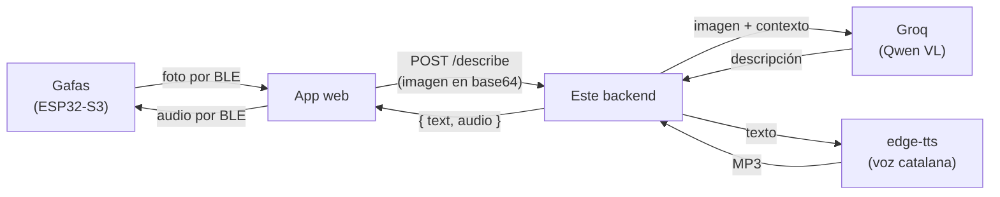

# Bonsai Backend

Backend de **Bonsai**, unas gafas inteligentes que cuentan en voz alta lo que
tienes delante: para orientarte, para leer un cartel o un menú, para saber qué
es un objeto o simplemente por curiosidad. Sirven igual a quien no ve bien que
a cualquiera que quiera preguntarle algo a lo que está mirando.

Este servidor concentra toda la inteligencia del sistema (visión, voz y
memoria) para que la ESP32 y la app web solo tengan que llamar a un endpoint
HTTP. El microcontrolador no habla con ninguna API de IA: solo saca la foto y
reproduce el audio.



En cada petición el servidor añade al prompt la fecha de hoy y los recuerdos
guardados de ese dispositivo, para que las descripciones tengan contexto.

Las respuestas son **de 1 o 2 frases** a propósito: todo lo que dice el modelo
hay que escucharlo después, así que cada frase de más son segundos de espera.
Si necesitas más detalle, se pide con el campo `prompt`.

- **Visión**: Groq con un modelo Qwen VL (~1-2 s).
- **Voz**: edge-tts, las voces neuronales de Microsoft, gratuitas y con
  **catalán** (`ca-ES-JoanaNeural` por defecto).
- **Memoria**: SQLite, un fichero, sin servicios externos.
- **Idiomas**: `ca` (por defecto), `es`, `en`.

---

## Índice

1. [Probarlo en tu ordenador](#1-probarlo-en-tu-ordenador)
2. [Terminal de pruebas](#2-terminal-de-pruebas)
3. [API](#3-api)
4. [Desplegarlo en una VPS](#4-desplegarlo-en-una-vps)
5. [Usarlo desde la app web o la ESP32](#5-usarlo-desde-la-app-web-o-la-esp32)
6. [Variables de entorno](#6-variables-de-entorno)
7. [Notas técnicas](#7-notas-técnicas)

---

## 1. Probarlo en tu ordenador

No hace falta Docker ni servidor: funciona entero en local. Solo necesitas
**Python 3.11 o superior** y una API key gratuita de
[console.groq.com](https://console.groq.com).

### Windows (PowerShell)

```powershell
git clone https://github.com/devvazquez/bonsai-backend.git
cd bonsai-backend
.\run-local.ps1
```

La primera vez el script crea el `.env` y se para para que pongas tu
`GROQ_API_KEY` dentro. Lo vuelves a ejecutar y ya arranca.

> Si PowerShell se queja de que no puede ejecutar scripts:
> `Set-ExecutionPolicy -Scope CurrentUser RemoteSigned`

### Linux / macOS

```bash
git clone https://github.com/devvazquez/bonsai-backend.git
cd bonsai-backend
chmod +x run-local.sh
./run-local.sh
```

El script se encarga de todo: crea el entorno virtual, instala las
dependencias, carga el `.env` y levanta el servidor con recarga automática
(al guardar un `.py`, se reinicia solo).

Cuando esté en marcha:

- API: <http://127.0.0.1:8080>
- Documentación interactiva (Swagger, se puede probar desde el navegador):
  <http://127.0.0.1:8080/docs>
- Comprobación rápida: <http://127.0.0.1:8080/health> debe devolver
  `{"ok":true,"groqKeyConfigured":true,...}`

En local no hace falta token (`BONSAI_API_TOKEN` vacío). La base de datos de
los recuerdos se crea en `./data/bonsai.db`.

<details>
<summary>Arrancarlo a mano, sin el script</summary>

```bash
python -m venv .venv
.venv/Scripts/activate        # Windows:  .venv\Scripts\Activate.ps1
pip install -r requirements.txt
cp .env.example .env          # y pon dentro tu GROQ_API_KEY
uvicorn main:app --host 127.0.0.1 --port 8080 --reload
```

En Linux/macOS, `source .venv/bin/activate`. Con este método hay que exportar
las variables del `.env` a mano (`set -a; . ./.env; set +a`).
</details>

---

## 2. Terminal de pruebas

`test_bonsai.py` es una consola interactiva para probarlo todo sin escribir
código. No necesita dependencias (solo la librería estándar), así que se puede
lanzar con el Python del sistema, en **otra terminal** mientras el servidor
está en marcha:

```bash
python test_bonsai.py
```

```
bonsai> health                          # ¿responde el servidor?
bonsai> voices ca                       # voces catalanas disponibles
bonsai> speak Hola Biel, les ulleres funcionen
bonsai> remember Al Biel li agrada el cafè sense sucre
bonsai> memories
bonsai> describe image.png              # la prueba completa: imagen -> texto -> audio
bonsai> config url https://bonsai.tudominio.com   # apuntar a la VPS
bonsai> config token el-token-de-la-vps
bonsai> help
```

`describe` guarda el MP3 en la carpeta actual, lo abre con el reproductor por
defecto y muestra el desglose de tiempos: cuánto tarda en codificar la imagen,
la visión, el TTS y la ida y vuelta completa.

El repositorio incluye una `image.png` de ejemplo para probar sin buscar fotos.

---

## 3. API

| Método | Ruta | Descripción |
| --- | --- | --- |
| `POST` | `/describe` | El endpoint principal: imagen → texto + audio |
| `POST` | `/speak?text=...&lang=ca` | Solo texto a voz. Devuelve el MP3 en crudo |
| `POST` | `/memory` | `{deviceId, fact}` — guarda un recuerdo |
| `GET` | `/memory/{deviceId}` | Lista los recuerdos del dispositivo |
| `DELETE` | `/memory/{deviceId}/{id}` | Borra un recuerdo (vale el prefijo del id) |
| `GET` | `/voices?prefix=ca` | Voces disponibles para un idioma |
| `GET` | `/health` | Estado del servicio. **Sin autenticación** |

### `POST /describe`

```jsonc
{
  "image": "<base64 sin el prefijo data:image/...>",
  "deviceId": "bonsai-01",
  "prompt": "¿Qué dice el cartel?",   // opcional; por defecto, descripción general
  "lang": "ca",                        // opcional: ca | es | en
  "voice": "ca-ES-EnricNeural",        // opcional: fuerza una voz concreta
  "audio": true                        // a false devuelve solo texto (mucho más rápido)
}
```

Respuesta:

```jsonc
{
  "text": "Estàs en una plaça empedrada amb edificis antics i llums de carrer enceses. Hi ha gent passejant i terrasses de cafès al fons.",
  "lang": "ca",
  "audio": "<MP3 en base64>",
  "audioFormat": "mp3",
  "voice": "ca-ES-JoanaNeural",
  "timings": { "memoria_ms": 0, "vision_ms": 1146, "tts_ms": 1350 }
}
```

`timings` viene en todas las respuestas: es la forma rápida de ver en qué
etapa se va el tiempo sin tocar los logs.

### Errores de `/describe`

| Código | Significa | Qué hacer |
| --- | --- | --- |
| `429` | Cuota de Groq agotada | Esperar y reintentar. Viene con la cabecera `Retry-After` en segundos, sacada de la respuesta de Groq |
| `502` | Groq o edge-tts han fallado de verdad | Mirar los logs; el detalle del error va en el cuerpo |
| `500` | Falta `GROQ_API_KEY` en el servidor | Revisar el `.env` |

Conviene que la app distinga el `429`: no es un fallo, solo hay que esperar
los segundos que diga `Retry-After` y volver a intentarlo, sin dar error a la
persona que lleva las gafas.

### Autenticación

Todos los endpoints salvo `/health` piden la cabecera:

```
X-API-Token: <tu-token>
```

Se activa definiendo `BONSAI_API_TOKEN`. Si se deja vacío, no se exige nada:
cómodo en local, **desaconsejado en un servidor público** — sin token,
cualquiera que descubra la URL puede gastar la cuota de Groq.

---

## 4. Desplegarlo en una VPS

Esta es la parte del despliegue en el servidor. Va con Docker, así que no hay
que instalar Python ni dependencias en la máquina.

### Requisitos

- Acceso SSH a la VPS.
- **Docker** y **Docker Compose** instalados.
- Un subdominio con un registro `A` apuntando a la IP de la VPS
  (p. ej. `bonsai.tudominio.com`).
- Puertos **80** y **443** abiertos, solo si se usa el Caddy incluido.
- Saber si **ya hay otro proxy inverso** en la máquina (Nginx, Traefik,
  Apache...): eso decide entre la opción A y la B de más abajo.

### 4.1. Clonar y configurar

```bash
git clone https://github.com/devvazquez/bonsai-backend.git
cd bonsai-backend
cp .env.example .env
openssl rand -hex 32        # genera un token seguro; cópialo
nano .env
```

```ini
GROQ_API_KEY=gsk_la_clave_real_de_groq
BONSAI_API_TOKEN=el-token-que-acabas-de-generar
BONSAI_DOMAIN=bonsai.tudominio.com
ALLOWED_ORIGINS=https://la-app-web-de-bonsai.com
```

El `.env` **nunca** se sube al repositorio (está en `.gitignore`).

### 4.2. Arrancar

#### Opción A — la VPS no tiene ningún proxy (lo más sencillo)

Levanta la app y un Caddy que gestiona el HTTPS solo, incluidos los
certificados de Let's Encrypt y sus renovaciones:

```bash
docker compose --profile caddy up -d --build
```

El DNS tiene que apuntar ya a la VPS **antes** de arrancar: Caddy pide el
certificado nada más levantarse.

#### Opción B — la VPS ya tiene Nginx u otro proxy

Levanta solo la aplicación, que escucha en `127.0.0.1:8080` sin exponerse a
internet:

```bash
docker compose up -d --build
```

Y se añade al proxy que ya existe algo equivalente a esto (Nginx):

```nginx
server {
    server_name bonsai.tudominio.com;

    client_max_body_size 12M;    # las imágenes en base64 ocupan

    location / {
        proxy_pass http://127.0.0.1:8080;
        proxy_set_header Host $host;
        proxy_set_header X-Real-IP $remote_addr;
        proxy_read_timeout 60s;  # visión + TTS puede tardar unos segundos
    }
}
```

Después, `certbot --nginx -d bonsai.tudominio.com` para el HTTPS.

### 4.3. Comprobar que va

```bash
docker compose ps            # el contenedor debe aparecer como "healthy"
docker compose logs -f       # logs en vivo
curl http://localhost:8080/health
```

Tiene que responder:

```json
{"ok":true,"groqKeyConfigured":true,"authRequired":true}
```

Si `groqKeyConfigured` sale `false`, la clave no ha llegado al contenedor:
revisa el `.env` y reinicia. Desde fuera, `curl https://bonsai.tudominio.com/health`.

La prueba de verdad es desde tu ordenador, con la terminal de pruebas
(sección 2): `config url https://bonsai.tudominio.com`, `config token ...`,
y luego `describe foto.jpg`.

### 4.4. Día a día

```bash
# Actualizar cuando haya cambios en el código
git pull && docker compose up -d --build

# Reiniciar / parar (los recuerdos sobreviven: están en un volumen)
docker compose restart
docker compose down

# Logs
docker compose logs -f bonsai

# Copia de seguridad de los recuerdos
docker compose cp bonsai:/data/bonsai.db ./backup-$(date +%F).db
```

**Consumo**: es un contenedor Python que casi todo el tiempo está esperando a
Groq. Con ~256 MB de RAM va sobrado y no usa GPU: toda la IA es remota.

---

## 5. Usarlo desde la app web o la ESP32

```javascript
const resp = await fetch("https://bonsai.tudominio.com/describe", {
  method: "POST",
  headers: {
    "Content-Type": "application/json",
    "X-API-Token": "el-token-de-la-vps",
  },
  body: JSON.stringify({
    deviceId: "bonsai-01",
    image: imagenEnBase64,   // sin el prefijo "data:image/jpeg;base64,"
    lang: "ca",
  }),
});

const { text, audio } = await resp.json();
// audio es un MP3 en base64: listo para reproducir o mandar por BLE
new Audio("data:audio/mpeg;base64," + audio).play();
```

Para la ESP32 suele salir mejor `/speak`, que devuelve el MP3 en crudo y
ahorra tener que decodificar base64 en el microcontrolador.

---

## 6. Variables de entorno

| Variable | Por defecto | Para qué sirve |
| --- | --- | --- |
| `GROQ_API_KEY` | — | **Obligatoria.** Clave de [console.groq.com](https://console.groq.com) |
| `BONSAI_API_TOKEN` | vacío | Protege la API. Vacío = sin autenticación |
| `ALLOWED_ORIGINS` | `*` | Orígenes CORS permitidos, separados por comas |
| `GROQ_VISION_MODEL` | `qwen/qwen3.6-27b` | Modelo de visión, por si Groq lo renombra |
| `BONSAI_DB_PATH` | `/data/bonsai.db` o `./data/bonsai.db` | Ruta de la base de datos de recuerdos |
| `BONSAI_DOMAIN` | — | Dominio para el HTTPS automático (solo con el perfil `caddy`) |
| `PORT` | `8080` | Puerto dentro del contenedor |

---

## 7. Notas técnicas

### Estructura

| Fichero | Contenido |
| --- | --- |
| `main.py` | La API: endpoints, autenticación, construcción del prompt |
| `groq_vision.py` | Cliente de Groq para describir imágenes |
| `tts.py` | Texto a voz con edge-tts y selección de voz por idioma |
| `memory.py` | Recuerdos por dispositivo en SQLite |
| `test_bonsai.py` | Terminal de pruebas, sin dependencias |
| `Dockerfile`, `docker-compose.yml`, `Caddyfile` | Despliegue |
| `run-local.ps1`, `run-local.sh` | Desarrollo en local sin Docker |

### Por qué Python y no Cloudflare Workers

La primera versión de este backend estaba en Cloudflare Workers. El requisito
del **catalán** obliga a usar edge-tts, que necesita un WebSocket con
cabeceras propias sobre un socket TCP real: algo que Workers no permite.

| Intento | Resultado |
| --- | --- |
| edge-tts a mano en Workers (fetch + Upgrade) | Microsoft devuelve cientos de frames binarios vacíos |
| npm `edge-tts-universal` en Workers | `ws` no funciona ahí → WebSocket sin cabeceras → 403 |
| Workers AI (`melotts`) | Funciona, pero no tiene catalán |
| Groq TTS | Solo inglés y árabe |
| **edge-tts en Python** | ✅ Funciona, con catalán |

De ahí que ahora sea un contenedor Python en una VPS.

### Latencia: dónde se va el tiempo

Todo lo de abajo está medido, no estimado. Cada respuesta trae su `timings`
para poder repetir las mediciones.

| Etapa | Tiempo | Comentario |
| --- | --- | --- |
| Subir la imagen + red hasta Groq | ~0,7 s | Depende de tu conexión de subida |
| Cómputo de Groq | **0,17 s** | Constante. Es la parte rápida |
| edge-tts, texto nuevo | 1,5-2,0 s hasta el primer trozo de audio | Escala con la longitud del texto |
| Escuchar el audio | ~10 s | 1-2 frases. Es el tramo más largo de todos |

Cosas comprobadas que **no** ayudan, para no perder el tiempo con ellas:

- **Comprimir o reducir la imagen no baja el coste.** Groq cobra la imagen a
  tanto alzado: medido, 1.812 `prompt_tokens` tanto con 1600x1065 (191 KB) como
  con 336x224 (18 KB), y su cómputo sigue siendo 0,17 s. Reducirla solo sirve
  para que la app tarde menos en subirla (eso sí importa con datos móviles) y
  para acortar el envío por BLE desde la ESP32.
- **Cambiar de modelo de visión no es una opción**: en Groq solo hay uno
  (`qwen/qwen3.6-27b`); el resto de su catálogo es texto, transcripción o TTS.
- **Partir el texto en frases y sintetizarlas en paralelo sale peor**: cada
  frase abre su propio WebSocket con Microsoft (~1,5 s), y compitiendo entre
  ellas el primer audio llegaba a los 2,4-5,6 s en vez de 1,5-2,0 s.

Cosas que sí ayudan y ya están hechas:

- **Nada de razonamiento paso a paso.** `reasoning_effort: "none"` en
  `groq_vision.py` no es decorativo: sin él el modelo escribe un bloque
  `<think>` que se come los 150 tokens y devuelve la respuesta truncada
  (medido: 2,28 s y respuesta inservible, contra 1,26 s y respuesta correcta).
- **Una sola conexión con Groq** para todo el proceso, en vez de abrir una por
  foto: el handshake TLS son ~220 ms medidos que ahora se pagan una vez.
- **Respuestas de 1 o 2 frases** (prompt + `max_completion_tokens: 150`):
  acorta las dos etapas que escalan con la longitud. Medido con la misma foto,
  pasar de 49 a 23 palabras baja la locución de ~21 s a ~10 s.
- **`/speak` va por trozos**, así que se puede empezar a reproducir en cuanto
  llega el primero en vez de esperar el MP3 entero (~1,3 s menos de espera).

**El camino más rápido** si la app quiere reaccionar cuanto antes: pedir
`/describe` con `"audio": false` (texto en ~0,9 s, se puede mostrar ya) y a
continuación `/speak` con ese texto, que va llegando a trozos. Así no se espera
a tener todo el audio generado antes de empezar a oír algo.

Un detalle que despista al medir: **Microsoft cachea el audio por texto y voz**.
Repetir la misma frase da ~0,5 s, mientras que una frase nueva cuesta 1,5-2,0 s.
En uso real el texto siempre es nuevo, así que hay que fiarse de los tiempos con
texto nuevo, no de los de un `/speak` repetido en pruebas.

### Otros apuntes

- **Modelo de Groq**: Groq renombra y retira modelos con frecuencia. Si
  `/describe` empieza a dar error 502, comprueba el nombre vigente en
  <https://console.groq.com/docs/models> y cámbialo con `GROQ_VISION_MODEL`,
  sin tocar el código.
- **Límites del plan gratuito de Groq**: cada foto gasta ~1.800 tokens, y el
  plan da 8.000 tokens por minuto y 200.000 al día. Salen unas **4 fotos por
  minuto y ~110 al día**. Como el coste por imagen es fijo, mandarla más pequeña
  no da más margen: si las gafas se van a usar de verdad a diario, hace falta el
  plan de pago.
- **edge-tts** usa un protocolo que Microsoft no documenta oficialmente (el
  mismo que la librería de Python homónima, muy usada y mantenida). Funciona
  bien, pero conviene saber que podría romperse si Microsoft lo cambiara.
- **Memoria**: por ahora solo guarda lo que se le manda explícitamente a
  `POST /memory`. El siguiente paso natural sería pedirle al modelo que
  devuelva un campo `{"remember": "..."}` y guardarlo solo.
- **Límite de recuerdos**: 50 por dispositivo (`MAX_ITEMS` en `memory.py`),
  para que el prompt no crezca sin control.
