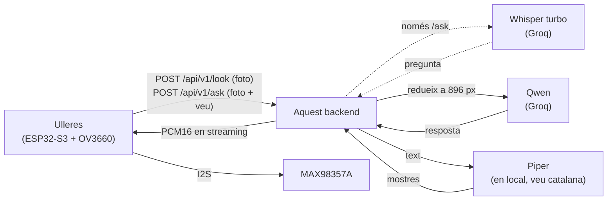
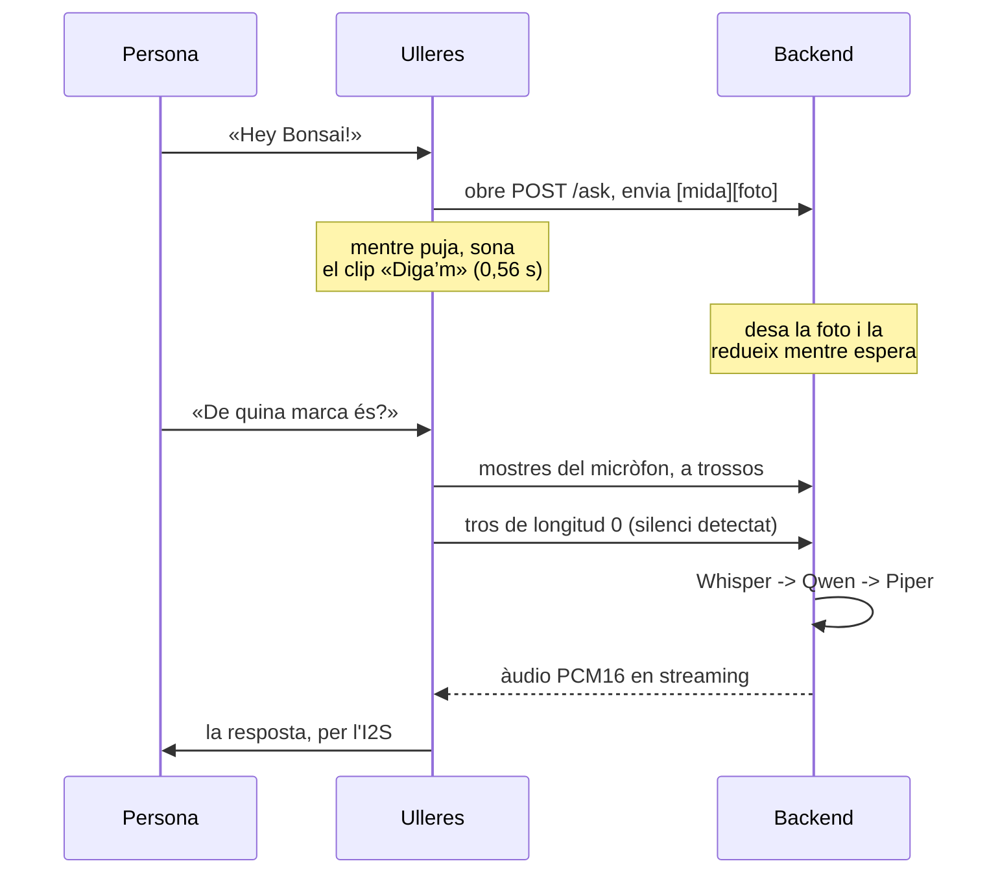

# Bonsai Backend

Backend de **Bonsai**, unes ulleres intel·ligents que expliquen en veu alta què
tens al davant: per orientar-te, per llegir un cartell o un menú, per saber què
és un objecte o simplement per curiositat.



**L'ESP32 crida l'API directament**, sense cap aplicació web al mig. Per això
els dos endpoints d'imatge estan fets a mida del microcontrolador: reben la
foto i tornen l'àudio en cru i en streaming, llest per a l'I2S.

Les peces:

- **Veu a text**: **Whisper turbo** a Groq, només per a `/ask`. Es factura per
  segons d'àudio, no per tokens: no toca la quota de les fotos.
- **Visió**: **Qwen** a Groq (`qwen/qwen3.6-27b`), 552 ms i molt regular.
- **Veu**: **Piper** en local (205 ms, veu catalana `ca_ES-upc_ona-medium`),
  sense xarxa i sense cap clau.
- **Memòria**: SQLite, un fitxer, sense serveis externs.

Amb la configuració per defecte, el **primer byte d'àudio surt a ~1,0-1,8 s**
des que arriba la foto. Totes les xifres d'aquest README estan mesurades, no
estimades — el detall i el perquè de cada decisió és a
**[docs/BENCHMARKS.md](docs/BENCHMARKS.md)** i a
**[CLAUDE.md](CLAUDE.md)**.

---

## Inici ràpid

Necessites **Python 3.11+** i una clau gratuïta de
[console.groq.com](https://console.groq.com). La veu no necessita cap clau:
Piper és local i es baixa sol (63 MB) la primera vegada.

```bash
git clone https://github.com/devvazquez/bonsai-backend.git
cd bonsai-backend
./scripts/run-local.sh          # Windows: .\scripts\run-local.ps1
```

El primer cop crea el `.env` i s'atura perquè hi posis la `GROQ_API_KEY`. El
tornes a executar i arrenca amb recàrrega automàtica.

| On | Què hi ha |
| --- | --- |
| <http://127.0.0.1:8080/api/v1> | L'API |
| `/docs` | Swagger, amb reproductor per escoltar les respostes |
| `/provar` | Fer una foto des del mòbil i escoltar la resposta |
| `/admin` | El panell de la base de dades (només amb `ADMIN_PASSWORD`) |
| `/health` | Estat del servei. Sense autenticació |

<details>
<summary>Arrencar-ho a mà, sense l'script</summary>

```bash
python -m venv .venv && source .venv/bin/activate   # Windows: .venv\Scripts\Activate.ps1
pip install -r requirements.txt
cp .env.example .env          # i posa-hi la teva GROQ_API_KEY
uvicorn app.main:app --host 127.0.0.1 --port 8080 --reload
```

El punt d'entrada és **`app.main:app`**, no `main:app`: el codi viu al paquet
`app/`.
</details>

<details>
<summary>Terminal de proves, sense dependències</summary>

```bash
python tests/smoke.py       # amb el servidor ja engegat
```

```
bonsai> describe image.png              # imatge -> text -> àudio, amb temps
bonsai> speak Hola, les ulleres funcionen
bonsai> remember Al Biel li agrada el cafè sense sucre
bonsai> help
```

Compte: `describe` gasta quota de Groq de veritat. Per provar sense gastar
res, `python tests/test_api.py`.
</details>

---

## Les dues pàgines

Les serveix el mateix backend, sense dependències ni CORS.

**`/provar`** — fes una foto des del mòbil i escolta la resposta. Redueix la
imatge abans de pujar-la, deixa triar l'idioma i ensenya el desglossament de
temps.


**`/admin`** — explorar qualsevol taula, crear-ne, afegir columnes, editar
files i executar SQL a mà. També és per on es toquen els records.


Això és **accés SQL complet a la base de dades**, així que la ruta només
existeix si defineixes `ADMIN_PASSWORD` (`openssl rand -hex 16`); sense la
variable torna 404.

> **Ara mateix `/admin` no arriba a muntar-se** per un cap solt al codi, així
> que dona 404 tinguis o no la contrasenya. Apuntat a `CLAUDE.md`.

---

## API

### Autenticació i versionat

**Tot l'API viu sota `/api/v1`**: `POST /api/v1/look`, `POST /api/v1/ask`, etc.
Les taules i els exemples d'aquí sota escriuen la ruta curta per no repetir el
prefix a cada línia, però la petició de veritat el porta.

El prefix hi és perquè el dia que calgui canviar el cos d'`/ask` o el format
d'una resposta es pugui muntar `/api/v2` al costat, sense deixar tirades les
ulleres que encara no tinguin el firmware nou. **No hi ha rutes sense prefix**:
`/look` i `/health` a seques tornen 404.

Les pàgines **no** van versionades, perquè s'obren al navegador i no són API:
`/provar` (amb l'àlies `/probar`) i `/admin`.

Tots els endpoints excepte `/health` i les pàgines demanen la capçalera
`X-API-Token` si `BONSAI_API_TOKEN` està definit. `/admin` no fa servir el
token: té la seva pròpia contrasenya.

### Endpoints

| Mètode | Ruta (afegeix-hi `/api/v1`) | Descripció |
| --- | --- | --- |
| `POST` | `/look` | **Principal**: foto → àudio en cru i en streaming |
| `POST` | `/ask` | Foto + pregunta dita en veu alta → àudio |
| `GET`/`POST` | `/speak?text=...&lang=ca` | Només text a veu |
| `GET` | `/audios?lang=ca` | Les frases fixes que porten les ulleres |
| `GET` | `/audios/{id}?lang=ca` | Una d'aquestes frases, com a àudio |
| `POST`/`GET` | `/memory` | Dispositius i records |
| `PATCH`/`DELETE` | `/memory/{deviceId}/{id}` | Corregeix o esborra un record |
| `GET` | `/health` | Estat del servei. Sense autenticació |

### `POST /look`

```jsonc
{
  "image": "<base64 sense el prefix data:image/...>",
  "deviceId": "bonsai-01",
  "prompt": "Què diu el cartell?",     // opcional; per defecte, descripció general
  "lang": "ca",                        // ca | es | en
  "audioFormat": "pcm16",              // pcm16 | mulaw | wav
  "sampleRate": 16000,                 // 8000 | 16000 | 22050
  "maxSide": 896,                      // 0 desactiva la reducció al servidor
  "tools": []                          // el que sap fer el dispositiu (veure «Tools»)
}
```

**El cos de la resposta és l'àudio**, en cru i en streaming; tot el context va a
capçaleres. Codis d'error:

| Codi | Vol dir |
| --- | --- |
| `429` | Quota esgotada. Ve amb `Retry-After` en segons: reintenta, no és una errada |
| `502` | Groq ha fallat de debò, o ha tornat una resposta buida; el detall va al cos |
| `500` | Falta `GROQ_API_KEY` al servidor |
| `400` | Paràmetres invàlids (`audioFormat`, `lang`, `sampleRate`, `tools`...) |

### `POST /ask`

Igual que `/look`, però la pregunta va dita en veu alta. El cos va **en cru,
sense JSON ni base64**:

```
4 bytes   uint32 big-endian   quants bytes ocupa la foto
N bytes   la foto (JPEG)
la resta  l'àudio del micròfon, fins que es tanca la petició
```

L'àudio pot ser **PCM16 mono en cru** —el que surt del micròfon PDM de la XIAO
ESP32-S3 Sense llegit per I2S; digues a quina freqüència amb `micRate`— o un
fitxer amb capçalera (WAV, OGG, m4a, MP3): es detecta sol.

El cos es pot enviar **en trossos, amb `Transfer-Encoding: chunked` i sense
`Content-Length`**, que és el que fa el firmware. Es llegeix a mesura que
arriba: la foto es guarda quan està sencera, mentre la persona encara parla.

Els paràmetres van a la query: `deviceId`, `lang`, `audioFormat`, `sampleRate`,
`micRate` (per defecte 16000) i `maxSide`.



L'encavalcament és el que fa que sembli ràpid: la foto es desa als 10 ms i es
redueix en un fil a part mentre s'espera el micròfon.
`X-Bonsai-Resize-Wait-Ms` diu el que s'ha hagut d'esperar de debò: normalment 0.
El que **no** se solapa és la transcripció: Whisper necessita l'àudio sencer.

Abans de la foto se li donen per dits dos torns de conversa —
`ASK_WAKE_PHRASE` i `ASK_WAKE_REPLY`— perquè contesti com qui continua una
conversa. **Han de coincidir amb el clip que sonen les ulleres** o li estaràs
explicant al model una conversa que no ha passat.

Cada petició (de `/look` també) deixa la foto a `captures/` i una fila a la
taula `captures`, visible a `/admin`. Se'n conserven les 100 últimes per
dispositiu, i és d'on surt l'historial de conversa (més avall).

| Codi | Vol dir |
| --- | --- |
| `400` | La trama està mal formada, o amb prou feines hi ha àudio |
| `408` | El micròfon porta 15 s sense enviar res (`ASK_SILENCE_TIMEOUT_SECONDS`) |
| `413` | Més de 30 s d'àudio (`ASK_MAX_AUDIO_SECONDS`) |
| `422` | No s'ha entès res. Mira el guany del micròfon, o tira de `/look` |
| `429` | Quota esgotada, amb `Retry-After` |

Per provar-ho des del portàtil, munta el cos amb
`struct.pack(">I", len(foto)) + foto + wav` i envia'l amb
`curl --data-binary @cos.bin`.

### `GET`/`POST /speak`

Només text a veu: `?text=...&lang=ca&audioFormat=wav&sampleRate=16000`. Val
igual amb `GET` que amb `POST` perquè no canvia res al servidor i tot va a la
query — amb `GET` la URL es pot posar directament en un `<audio src="...">`,
que és el que fa el reproductor de `/docs`.

Aquí el format per defecte és **`wav`**, no `pcm16` com a `/look`: ve de quan
`/speak` només servia per escoltar coses des del navegador.

### `GET /audios` i `GET /audios/{id}`

Les frases fixes que diu el dispositiu quan encara no pot parlar amb el
backend: `first_boot`, `no_wifi`, `start_talking` (el «Digue'm» que sona mentre
puja la foto) i `missing_config`. Viuen a `app/audios.py` i no al firmware, així
canviar-ne una és un desplegament i no reflashejar totes les ulleres.

`GET /audios?lang=ca` torna els textos i quins falten en aquell idioma;
`GET /audios/start_talking?lang=ca&audioFormat=pcm16&sampleRate=16000` torna
l'àudio llest per a l'I2S, amb l'id a la capçalera `X-Bonsai-Audio`.

**Els ids són contracte amb el firmware** (`Audio::DefaultAudios` els demana pel
nom): els textos i els idiomes es poden canviar, els ids no.

El dispositiu se'ls baixa al primer arrencada i els desa a la SD, així sempre
són la veu que hi ha posada al servidor. Per tenir-los a mà des de l'ordinador,
`python scripts/generate_audios.py` els deixa a `assets/`.

### Tools: les declara el dispositiu

Perquè «Hey Bonsai, canvia l'idioma a espanyol» faci alguna cosa, **la ESP32
diu a cada petició què sap fer** i el backend ho reenvia al model. El catàleg
d'accions viu només al firmware: així no hi ha una taula duplicada als dos
costats.

```jsonc
// dins del cos de /look (a /ask, a la capçalera X-Bonsai-Tools en base64)
"tools": [{
  "name": "change_lang",
  "description": "Canvia l'idioma en què parlen les ulleres.",
  "parameters": {
    "type": "object",
    "properties": { "lang": { "type": "string", "enum": ["ca", "es", "en"] } },
    "required": ["lang"]
  }
}]
```

Si el model en crida alguna, torna a la capçalera `X-Bonsai-Tools` de la
resposta, en base64:

```json
[{"name": "change_lang", "args": {"lang": "es"}}]
```

**El backend no n'executa cap.** `change_lang` no canvia res aquí: no hi ha
idioma guardat per dispositiu, `lang` és un paràmetre per petició. Actuen les
ulleres, i envien un `lang` diferent la propera vegada.

L'àudio arriba igualment: si el model crida una tool i no diu res (que és el
que solen fer), el servidor respon «Fet.» en comptes de deixar les ulleres
mudes. Hi ha un topall de mida a les definicions (`TOOLS_MAX_CHARS`, 2.000
caràcters) perquè són tokens de prompt a cada petició.

### Historial de conversa

`/look` i `/ask` deixen les últimes converses d'un dispositiu com a context de
les següents: si preguntes «i en castellà?» just després d'una foto, el model
sap de què li parles. Només hi va **text** — la pregunta i la resposta, mai la
foto—, perquè Groq cobra tokens per imatge i una foto de fa un minut ja no és
«el que tinc davant», és confusió.

Es controla amb `HISTORY_MAX_TURNS` (per defecte 3) i `HISTORY_MAX_MINUTES`
(per defecte 10): passats els minuts o el compte de torns, la conversa més
antiga es queda fora. És per `deviceId`, així que no es barreja entre
dispositius. Posar qualsevol dels dos a `0` ho desactiva.

### Capçaleres `X-Bonsai-*`

El cos de `/look`, `/ask`, `/speak` i `/audios/{id}` és àudio, o sigui que tot
el context va a capçaleres. El text va en base64 perquè les capçaleres HTTP són
ASCII.

| Capçalera | On | Què és |
| --- | --- | --- |
| `X-Bonsai-Text` | totes | La frase que es diu, en base64 |
| `X-Bonsai-Format` · `-Rate` · `-Bits` · `-Channels` | totes | El format real de l'àudio, per configurar l'I2S sense endevinar |
| `X-Bonsai-Voice` · `-Tts` | totes | Quina veu i quin motor |
| `X-Bonsai-Model` | `/look`, `/ask` | El model de visió |
| `X-Bonsai-Vision-Ms` · `-Resize-Ms` | `/look`, `/ask` | Temps de visió i de reduir la foto |
| `X-Bonsai-Tools` | `/look`, `/ask` | Les tools que el model ha decidit cridar (només si n'hi ha) |
| `X-Bonsai-Transcript` · `-Stt-Ms` · `-Stt-Model` | `/ask` | Què s'ha entès i amb què |
| `X-Bonsai-Audio-Secs` · `-Audio-Bytes` · `-Upload-Ms` | `/ask` | Quant àudio ha pujat el micròfon |
| `X-Bonsai-Resize-Wait-Ms` · `-Capture-Id` | `/ask` | Espera real per la reducció, i l'id de la captura |
| `X-Bonsai-Audio` | `/audios/{id}` | L'id de la frase |

### Formats d'àudio

| `audioFormat` | Què surt |
| --- | --- |
| `pcm16` | Enters de 16 bits amb signe, little-endian, mono: el que vol l'I2S del MAX98357A, sense conversió |
| `mulaw` | μ-law de 8 bits, la meitat de bytes |
| `wav` | El mateix que `pcm16` amb capçalera RIFF, per a navegadors |

I `sampleRate` és 8000, 16000 o 22050 Hz. Qualsevol altre valor dona un 400 amb
la llista, abans de sintetitzar res.

> **La resposta ve trossejada.** Va en streaming, així que no hi ha
> `Content-Length` sinó `Transfer-Encoding: chunked`, i cada tros porta al
> davant la seva mida en hexadecimal i un `\r\n`. Si l'escrius a l'I2S tal com
> surt del socket sentiràs un clic a cada tros. Amb `HTTPClient` de l'Arduino,
> `writeToStream()` ho treu sol. És el parany més fàcil de trepitjar.

El `wav` és l'única excepció: es munta sencer per poder posar les longituds de
veritat a la capçalera, que és el que necessita un reproductor per saber quant
dura.

---

## Idiomes i veus

Els endpoints reben `lang` (`ca` | `es` | `en`) i **no** una veu: quina veu li
toca a cada idioma es decideix al codi, en un diccionari:

```python
# app/tts.py — la veu de cada idioma. Això és el que es toca.
VOICES = {
    "ca": "ca_ES-upc_ona-medium",
    "es": "es_ES-davefx-medium",
    "en": "en_GB-alba-medium",
}
```

Per canviar una veu, s'escriu un altre nom de
[rhasspy/piper-voices](https://huggingface.co/rhasspy/piper-voices) i prou: **si
no està al disc, es baixa sola** el primer cop que es demana aquell idioma (13,1
s mesurats per als 63 MB del model castellà, 53 ms la següent). La de l'idioma
per defecte es baixa en arrencar el servidor.

Un idioma que no estigui al diccionari dona un **400 dient quins hi ha**, en
comptes de contestar en català per sota. `GET /api/v1/health` diu quina veu té
cada idioma i si ja està baixada.

En català només hi ha tres veus al repositori de Piper; la comparativa és a
[docs/BENCHMARKS.md](docs/BENCHMARKS.md).

---

## Variables d'entorn

| Variable | Per defecte | Per a què serveix |
| --- | --- | --- |
| `GROQ_API_KEY` | — | **Obligatòria**: visió i transcripció van totes dues per Groq |
| `BONSAI_API_TOKEN` | buit | Protegeix l'API. Buit = sense autenticació |
| `ADMIN_PASSWORD` | buit | Contrasenya de `/admin`. Buida = la ruta ni existeix |
| `IMAGE_MAX_SIDE` | `896` | Costat llarg al qual es redueix la foto. `0` ho desactiva |
| `GROQ_VISION_MODEL` | `qwen/qwen3.6-27b` | Model de visió |
| `GROQ_STT_MODEL` | `whisper-large-v3-turbo` | Model de transcripció de `/ask` |
| `ASK_MAX_AUDIO_SECONDS` | `30` | Topall de gravació de `/ask` |
| `HISTORY_MAX_TURNS` / `HISTORY_MAX_MINUTES` | `3` / `10` | Historial de conversa passat al model. `0` ho desactiva |
| `ASK_SILENCE_TIMEOUT_SECONDS` | `15` | Sense cap tros del micròfon en tant de temps, `408` |
| `ASK_WAKE_PHRASE` / `ASK_WAKE_REPLY` | `Hey Bonsai!` / `Diga’m!` | Els dos torns donats per dits |
| `TOOLS_MAX_CHARS` | `2000` | Topall de les definicions de tools |
| `PIPER_VOICES_DIR` | `app/voices` | On es desen els models de veu |
| `BONSAI_DOMAIN` | — | Domini per a l'HTTPS (perfil `caddy`) |
| `ALLOWED_ORIGINS` | `*` | Orígens CORS (només rellevant si hi ha una app web) |

Més variables i el perquè de cada valor per defecte, a
[`.env.example`](.env.example).

---

## Desplegar-ho en un VPS

```bash
git clone https://github.com/devvazquez/bonsai-backend.git && cd bonsai-backend
cp .env.example .env
openssl rand -hex 32        # token per BONSAI_API_TOKEN
nano .env                   # GROQ_API_KEY, BONSAI_API_TOKEN, BONSAI_DOMAIN
```

**Si el VPS no té cap proxy**, Caddy gestiona l'HTTPS sol (Let's Encrypt
inclòs; el DNS ha d'apuntar ja al VPS):

```bash
docker compose --profile caddy up -d --build
```

<details>
<summary>Si ja hi ha Nginx o un altre proxy</summary>

Aixeca només l'app (`127.0.0.1:8080`) i afegeix-hi això:

```nginx
location / {
    proxy_pass http://127.0.0.1:8080;
    proxy_set_header Host $host;
    proxy_read_timeout 60s;
    proxy_buffering off;     # imprescindible: /look va en streaming

    # El panell /admin parla per WebSocket (/socket.io). Sense aquestes dues
    # línies carrega la pàgina i es queda en blanc.
    proxy_http_version 1.1;
    proxy_set_header Upgrade $http_upgrade;
    proxy_set_header Connection "upgrade";
}
```

Amb Caddy no cal fer res: ja passa els WebSockets sol.
</details>

Comprova amb `curl http://localhost:8080/api/v1/health`: mira que
`vision.keyConfigured` sigui `true` i que `tts.piper.ok` també (si no, Piper ha
fallat i el motiu és a `tts.piper.error`).

```bash
git pull && docker compose up -d --build   # actualitzar
docker compose logs -f bonsai              # logs
docker compose cp bonsai:/data/bonsai.db ./backup-$(date +%F).db
```

**Recursos**: 1 GB de RAM (Piper en fa servir ~210 MB, el panell ~40 MB) i n'hi
ha prou amb **1 vCPU** — Piper és monofil, més nuclis no baixen la latència.

---

## Estructura

El codi és un paquet: s'arrenca amb `app.main:app`.

```
app/        el backend
tests/      test_api.py (automàtic, 0 tokens) · smoke.py (manual, gasta quota)
scripts/    bench_latency.py, generate_audios.py, run-local.sh, run-local.ps1
docs/       BENCHMARKS.md i les captures de pantalla
```

| Fitxer | Contingut |
| --- | --- |
| `app/main.py` | L'API: endpoints, autenticació, construcció del prompt |
| `app/vision.py` | Visió amb Groq, i el client HTTP compartit |
| `app/stt.py` | Transcripció amb Whisper turbo (només `/ask`) |
| `app/tts.py` | Veu amb Piper, en local |
| `app/images.py` | Redueix la foto abans d'enviar-la a Groq |
| `app/memory.py` | Records i captures per dispositiu, en SQLite |
| `app/audios.py` | Les frases fixes que porten les ulleres |
| `app/panel.py` | El panell `/admin` |
| `app/static/probar.html` | La pàgina `/provar` |
| `tests/test_api.py` | Prova l'API de punta a punta sense gastar quota |
| `tests/smoke.py` | Terminal de proves manual, sense dependències |
| `scripts/bench_latency.py` | Banc de proves de latència, amb topall de quota |
| `scripts/generate_audios.py` | Genera els àudios fixos a `assets/` |

---

## Més informació

- **[docs/BENCHMARKS.md](docs/BENCHMARKS.md)** — totes les mesures: latències
  per etapa, comparatives de veus, configuració de la càmera OV3660 i formats
  d'àudio en detall.
- **[CLAUDE.md](CLAUDE.md)** — el perquè de cada decisió, què s'ha provat i
  descartat, i els paranys que ja s'han trepitjat una vegada.
