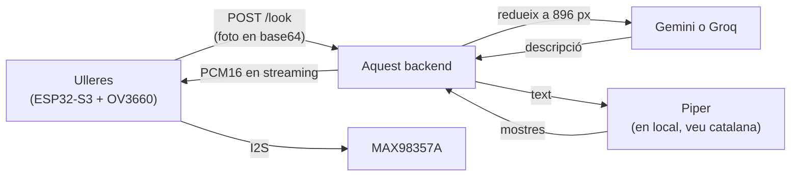

# Bonsai Backend

Backend de **Bonsai**, unes ulleres intel·ligents que expliquen en veu alta què
tens al davant: per orientar-te, per llegir un cartell o un menú, per saber què
és un objecte o simplement per curiositat. Serveixen igual a qui no hi veu bé
que a qualsevol que vulgui preguntar alguna cosa sobre allò que està mirant.

Aquest servidor concentra tota la intel·ligència del sistema (visió, veu i
memòria) perquè l'ESP32 només hagi de cridar un endpoint HTTP. El
microcontrolador no parla amb cap API d'IA: només fa la foto i reprodueix
l'àudio.



**L'ESP32 crida l'API directament.** No hi ha cap aplicació web al mig, i el
backend no n'espera cap: si algun dia n'hi ha una, serà per configurar el
dispositiu de tant en tant, no per fer funcionar les ulleres. Per això només hi
ha un endpoint d'imatge, `/look`, i està fet a mida del microcontrolador.

El que sí que hi ha són pàgines de servei que serveix el mateix backend, per
provar-lo i administrar-lo des d'un navegador: `/provar` i `/memoria`.

A cada petició el servidor afegeix al prompt la data d'avui i els records
guardats d'aquell dispositiu, perquè les descripcions tinguin context.

Les respostes són **d'1 o 2 frases** a propòsit: tot el que diu el model s'ha
d'escoltar després, així que cada frase de més són segons d'espera. Si et cal
més detall, es demana amb el camp `prompt`.

- **Visió**: dos proveïdors intercanviables, **Groq** (per defecte: 552 ms
   mesurats i molt regular, però 8.000 tokens/minut) i **Gemini** (més lent,
   quota molt més folgada, va bé per desenvolupar).
- **Veu**: **Piper** en local (per defecte), veu catalana `ca_ES-upc_ona-medium`
  de la UPC, 205 ms i sense dependre de ningú. edge-tts continua disponible.
- **Memòria**: SQLite, un fitxer, sense serveis externs.
- **Idiomes**: `ca` (per defecte), `es`, `en`.

Amb la configuració més ràpida, el **primer byte d'àudio surt a ~1,0-1,8 s** des
que arriba la foto. Tots els números d'aquest README estan mesurats, no
estimats; el desglossament és a [Latència](#latència-on-sen-va-el-temps).

---

## Índex

1. [Provar-ho al teu ordinador](#1-provar-ho-al-teu-ordinador)
2. [Les pàgines web](#2-les-pàgines-web)
3. [Terminal de proves](#3-terminal-de-proves)
4. [API](#4-api)
5. [Desplegar-ho en un VPS](#5-desplegar-ho-en-un-vps)
6. [Usar-ho des de l'ESP32](#6-usar-ho-des-de-lesp32)
7. [Variables d'entorn](#7-variables-dentorn)
8. [Notes tècniques](#8-notes-tècniques)

---

## 1. Provar-ho al teu ordinador

No cal Docker ni servidor: funciona sencer en local. Només necessites **Python
3.11 o superior** i una clau d'API gratuïta de
[console.groq.com](https://console.groq.com) (o de
[aistudio.google.com/apikey](https://aistudio.google.com/apikey) si prefereixes
Gemini, que té la quota més folgada per desenvolupar).

La veu **no** necessita cap clau: Piper sintetitza en local. El primer cop que
arrenca es baixa sol el model de la veu catalana (63 MB) a `voices/`.

### Windows (PowerShell)

```powershell
git clone https://github.com/devvazquez/bonsai-backend.git
cd bonsai-backend
.\run-local.ps1
```

El primer cop l'script crea el `.env` i s'atura perquè hi posis la teva
`GROQ_API_KEY`. El tornes a executar i ja arrenca.

> Si el PowerShell es queixa que no pot executar scripts:
> `Set-ExecutionPolicy -Scope CurrentUser RemoteSigned`

### Linux / macOS

```bash
git clone https://github.com/devvazquez/bonsai-backend.git
cd bonsai-backend
chmod +x run-local.sh
./run-local.sh
```

L'script s'encarrega de tot: crea l'entorn virtual, instal·la les dependències,
carrega el `.env` i aixeca el servidor amb recàrrega automàtica (en desar un
`.py`, es reinicia sol).

Quan estigui en marxa:

- API: <http://127.0.0.1:8080>
- Provar-ho amb una foto: <http://127.0.0.1:8080/provar>
- Veure i editar la memòria: <http://127.0.0.1:8080/memoria>
- Documentació interactiva (Swagger): <http://127.0.0.1:8080/docs>
- Comprovació ràpida: <http://127.0.0.1:8080/health> diu quin proveïdor de
  visió hi ha actiu, si té la clau posada i si el Piper ha carregat bé

En local no cal token (`BONSAI_API_TOKEN` buit). La base de dades dels records
es crea a `./data/bonsai.db`.

<details>
<summary>Arrencar-ho a mà, sense l'script</summary>

```bash
python -m venv .venv
.venv/Scripts/activate        # Windows:  .venv\Scripts\Activate.ps1
pip install -r requirements.txt
cp .env.example .env          # i posa-hi la teva GROQ_API_KEY
uvicorn main:app --host 127.0.0.1 --port 8080 --reload
```

A Linux/macOS, `source .venv/bin/activate`. Amb aquest mètode cal exportar les
variables del `.env` a mà (`set -a; . ./.env; set +a`).
</details>

---

## 2. Les pàgines web

Les serveix el mateix backend, així que no hi ha CORS ni cal muntar res a part:
n'hi ha prou d'obrir la IP del servidor al navegador.

### `/provar` — fer una foto i escoltar la resposta

Pensada per al mòbil. El botó obre la càmera del darrere amb
`<input type="file" capture="environment">`, que a diferència de
`getUserMedia` **no exigeix HTTPS**: per això es pot provar per IP local sense
muntar certificats.

Redueix la foto a 896 px **al mateix mòbil** abans de pujar-la, perquè amb
dades mòbils la pujada és la part més lenta de totes: una foto de 12 MP passa
de ~3 MB a ~60 KB. Fa servir `createImageBitmap`, que respecta l'orientació
EXIF.

Deixa triar proveïdor, idioma, veu i pregunta concreta, recorda els ajustos
entre fotos i ensenya el desglossament de temps, així que també serveix de banc
de proves de mà.

### `/memoria` — veure i editar què recorden les ulleres

Fins ara la base de dades només es podia tocar a cop de `curl` i calia saber-se
els `deviceId` de memòria. Aquesta pàgina els llista tots amb quants records té
cadascun, i permet **afegir, editar en línia i esborrar** sense sortir del
navegador. A dalt a la dreta hi ha l'estat de la base de dades: quants records,
quants dispositius, quant ocupa i el límit per dispositiu.

Si el servidor demana token, el demana un sol cop i el desa al navegador.

### `sqlite-web` — administrar la base de dades a fons

`/memoria` cobreix el dia a dia sense tocar SQL, però per a qualsevol altra
cosa (crear taules, afegir columnes, índexs, consultes a mà, importar o
exportar) hi ha **[sqlite-web](https://github.com/coleifer/sqlite-web)**, que
ja està fet i està molt més provat que res que poguéssim escriure aquí. Ve com
un perfil de Docker Compose que **només s'aixeca quan cal**:

```bash
docker compose --profile admin up -d
```

Escolta a `127.0.0.1:8081` i **mai s'exposa a internet**, perquè és accés SQL
complet al fitxer. Per arribar-hi des del teu portàtil, túnel SSH:

```bash
ssh -L 8081:127.0.0.1:8081 usuari@la-vps
```

i obre <http://127.0.0.1:8081>. A més del túnel demana la contrasenya de
`SQLITE_WEB_PASSWORD`, per si algú altre entra a la màquina.

Quan acabis, `docker compose --profile admin down` i tornes a deixar-ho tancat.

| Per a què | Fes servir |
| --- | --- |
| Veure i editar records del dia a dia | `/memoria` |
| Crear taules, columnes, índexs | sqlite-web |
| Consultes SQL a mà | sqlite-web |
| Importar o exportar CSV/JSON | sqlite-web |

---

## 3. Terminal de proves

`test_bonsai.py` és una consola interactiva per provar-ho tot sense escriure
codi. No necessita dependències (només la biblioteca estàndard), així que es
pot llançar amb el Python del sistema, en **una altra terminal** mentre el
servidor està en marxa:

```bash
python test_bonsai.py
```

```
bonsai> health                          # què hi ha actiu al servidor?
bonsai> voices ca                       # veus catalanes disponibles
bonsai> speak Hola Biel, les ulleres funcionen
bonsai> remember Al Biel li agrada el cafè sense sucre
bonsai> memories
bonsai> describe image.png              # la prova sencera: imatge -> text -> àudio
bonsai> config url https://bonsai.eldomini.com   # apuntar al VPS
bonsai> config token el-token-del-vps
bonsai> help
```

`describe` desa l'àudio a la carpeta actual amb l'extensió que toqui (WAV amb
Piper, MP3 amb edge-tts), l'obre amb el reproductor per defecte i mostra el
desglossament de temps.

Es pot canviar de proveïdor sobre la marxa amb `config provider groq` i
`config tts edge`, útil per comparar sense reiniciar el servidor.

El repositori inclou una `image.png` d'exemple per provar sense buscar fotos.

---

## 4. API

| Mètode | Ruta | Descripció |
| --- | --- | --- |
| `POST` | `/look` | **L'endpoint principal**: foto → àudio en cru i en streaming |
| `POST` | `/speak?text=...&lang=ca` | Només text a veu. Torna l'àudio en cru |
| `GET` | `/memory` | Tots els dispositius amb records, i l'estat de la base de dades |
| `POST` | `/memory` | `{deviceId, fact}` — desa un record |
| `GET` | `/memory/{deviceId}` | Llista els records del dispositiu |
| `PATCH` | `/memory/{deviceId}/{id}` | `{fact}` — corregeix el text d'un record |
| `DELETE` | `/memory/{deviceId}/{id}` | Esborra un record (val el prefix de l'id) |
| `DELETE` | `/memory/{deviceId}` | Buida el dispositiu sencer |
| `GET` | `/voices?prefix=ca` | Veus disponibles per a un idioma |
| `GET` | `/provar` | Pàgina per fer una foto des del mòbil. **Sense autenticació** |
| `GET` | `/memoria` | Pàgina per administrar la memòria. **Sense autenticació** |
| `GET` | `/health` | Estat del servei. **Sense autenticació** |

Les dues pàgines es serveixen sense token perquè són HTML, no dades: el que hi
ha al darrere sí que va protegit, perquè demanen les dades a l'API amb la
capçalera `X-API-Token`.

### `POST /look`

L'únic endpoint d'imatge que hi ha. Abans n'hi havia dos, `/describe` (JSON amb
l'àudio en base64) i `/look`, però `/describe` només tenia sentit si hi hagués
una aplicació web al mig, i no n'hi ha: l'ESP32 crida l'API directament.
Mantenir-ne dos era mantenir dos camins per a la mateixa cosa.

```jsonc
{
  "image": "<base64 sense el prefix data:image/...>",
  "deviceId": "bonsai-01",
  "prompt": "Què diu el cartell?",     // opcional; per defecte, descripció general
  "lang": "ca",                        // opcional: ca | es | en
  "provider": "groq",                  // opcional: groq | gemini. Per defecte, VISION_PROVIDER
  "tts": "piper",                      // opcional: piper | edge. Per defecte, TTS_PROVIDER
  "audioFormat": "pcm16",              // pcm16 | mulaw | wav, o mp3 amb edge
  "sampleRate": 16000,                 // 8000 | 16000 | 22050
  "voice": "ca_ES-upc_ona-medium",     // opcional: força una veu concreta
  "maxSide": 896                       // opcional: 0 desactiva la reducció al servidor
}
```

**El cos de la resposta és l'àudio**, en cru i en streaming. El text i tot el
context van a capçaleres, perquè el cos no s'ha de parsejar:

```
X-Bonsai-Text: <el text, UTF-8 en base64>
X-Bonsai-Provider: groq        X-Bonsai-Model: qwen/qwen3.6-27b
X-Bonsai-Tts: piper            X-Bonsai-Voice: ca_ES-upc_ona-medium
X-Bonsai-Format: pcm16         X-Bonsai-Rate: 16000
X-Bonsai-Bits: 16              X-Bonsai-Channels: 1
X-Bonsai-Vision-Ms: 552        X-Bonsai-Resize-Ms: 192
```

El text va en base64 perquè les capçaleres HTTP només admeten ASCII i les
respostes porten accents.

Des d'un navegador, demana `"audioFormat": "wav"`: arriba amb capçalera i es
pot posar directament en un `<audio>`. Des de l'ESP32, `pcm16`, que és el que
vol l'I2S sense conversió. Amb `"tts": "edge"` el format només pot ser `mp3`,
perquè és el que dóna Microsoft.

### Triar el proveïdor de visió

N'hi ha dos, amb la mateixa interfície, i es canvia per petició amb el camp
`provider` sense reiniciar res:

| Proveïdor | Model per defecte | Capa gratuïta | Per a què |
| --- | --- | --- | --- |
| `groq` (per defecte) | `qwen/qwen3.6-27b` | 8.000 tokens/min, 200.000 tokens/dia | El més ràpid i el més regular. La quota s'esgota de seguida |
| `gemini` | `gemini-3.1-flash-lite` | 250.000 tokens/min, 1.500 peticions/dia | Més lent, però la quota dóna per desenvolupar de debò |

El límit de Groq és **per organització, no per clau d'API**: crear una clau nova
no reinicia el comptador.

I un avís que no és tècnic: a la **capa gratuïta** de Google, Google entrena amb
el que li envies (*"Google uses the content you submit to the Services and any
generated responses to provide, improve, and develop Google products"*). A la de
pagament, no. Per a unes ulleres que fotografien el carrer i la gent que hi
passa, això compta.

### Triar el motor de veu

Igual que amb la visió, n'hi ha dos i es canvia per petició amb el camp `tts`:

| Motor | Veu per defecte (ca) | Latència mesurada | Format | Notes |
| --- | --- | --- | --- | --- |
| `piper` (per defecte) | `ca_ES-upc_ona-medium` | **205 ms** (182-422) | WAV | En local, sense xarxa ni quota |
| `edge` | `ca-ES-JoanaNeural` | 1.320 ms (949-2.089) | MP3 | Millor qualitat de veu |

En una petició sencera amb foto, el canvi es nota: **1.170 ms amb Piper contra
2.575 ms amb edge-tts**, amb la mateixa imatge i el mateix model de visió.

Dues coses a tenir en compte:

- **El format canvia.** Piper torna WAV i edge-tts, MP3. La resposta ho diu a
  `audioFormat` i `/speak` al `Content-Type`; no ho donis per fet. El WAV pesa
  força més (247 KB contra 66 KB en la mateixa frase), cosa que importa per BLE
  i amb dades mòbils.
- **La veu de Piper sona més robòtica.** És un model VITS, no una veu neuronal
  d'Azure. Si prefereixes la qualitat a la latència, `TTS_PROVIDER=edge`.

Els models de Piper (63 MB per a `upc_ona` medium) **es baixen sols el primer
cop que arrenca el servidor** i queden a `voices/`. Per tenir-los abans, per
exemple en construir la imatge de Docker:

```sh
python descargar_voces.py            # la de per defecte (català)
python descargar_voces.py --todas
```

Si Piper no està disponible (falta el model, o la llibreria), el servidor **no
es queda mut**: fa servir edge-tts i ho diu a `/health`, a `tts.active` i
`tts.piper.error`. L'apedaçament és visible expressament.

### Errors de `/look`

| Codi | Vol dir | Què fer |
| --- | --- | --- |
| `429` | Quota del proveïdor esgotada | Esperar i reintentar. Ve amb la capçalera `Retry-After` en segons |
| `502` | El proveïdor o edge-tts han fallat de debò | Mirar els logs; el detall va al cos, amb el tipus d'excepció |
| `500` | Falta la clau del proveïdor triat | Revisar el `.env` |
| `400` | `provider` o `tts` no són vàlids | Corregir la petició |

Convé que el client distingeixi el `429`: no és una errada, només cal esperar
els segons que digui `Retry-After` i tornar-ho a provar, sense donar error a la
persona que porta les ulleres.

### Autenticació

Tots els endpoints excepte `/health`, `/provar` i `/memoria` demanen la
capçalera:

```
X-API-Token: <el-teu-token>
```

S'activa definint `BONSAI_API_TOKEN`. Si es deixa buit, no s'exigeix res: còmode
en local, **desaconsellat en un servidor públic** — sense token, qualsevol que
descobreixi la URL pot gastar la quota del proveïdor de visió.

---

## 5. Desplegar-ho en un VPS

Va amb Docker, així que no cal instal·lar Python ni dependències a la màquina.

### Requisits

- Accés SSH al VPS.
- **Docker** i **Docker Compose** instal·lats.
- Un subdomini amb un registre `A` apuntant a la IP del VPS
  (p. ex. `bonsai.eldomini.com`).
- Ports **80** i **443** oberts, només si es fa servir el Caddy inclòs.
- Saber si **ja hi ha un altre proxy invers** a la màquina (Nginx, Traefik,
  Apache...): això decideix entre l'opció A i la B.

### 5.1. Clonar i configurar

```bash
git clone https://github.com/devvazquez/bonsai-backend.git
cd bonsai-backend
cp .env.example .env
openssl rand -hex 32        # genera un token segur; copia'l
nano .env
```

```ini
GROQ_API_KEY=la_clau_real_de_groq
BONSAI_API_TOKEN=el-token-que-acabes-de-generar
BONSAI_DOMAIN=bonsai.eldomini.com
```

El `.env` **mai** es puja al repositori (està al `.gitignore`).

### 5.2. Arrencar

#### Opció A — el VPS no té cap proxy (el més senzill)

Aixeca l'aplicació i un Caddy que gestiona l'HTTPS sol, inclosos els
certificats de Let's Encrypt i les renovacions:

```bash
docker compose --profile caddy up -d --build
```

El DNS ha d'apuntar al VPS **abans** d'arrencar: el Caddy demana el certificat
tot just aixecar-se.

#### Opció B — el VPS ja té Nginx o un altre proxy

Aixeca només l'aplicació, que escolta a `127.0.0.1:8080` sense exposar-se:

```bash
docker compose up -d --build
```

I s'afegeix al proxy que ja existeix alguna cosa equivalent a això (Nginx):

```nginx
server {
    server_name bonsai.eldomini.com;

    client_max_body_size 12M;    # les imatges en base64 ocupen

    location / {
        proxy_pass http://127.0.0.1:8080;
        proxy_set_header Host $host;
        proxy_set_header X-Real-IP $remote_addr;
        proxy_read_timeout 60s;  # visió + TTS pot trigar uns segons
        proxy_buffering off;     # important: /look va en streaming
    }
}
```

Després, `certbot --nginx -d bonsai.eldomini.com` per a l'HTTPS.

> `proxy_buffering off` no és opcional: sense això el proxy es guarda tot
> l'àudio abans d'enviar-lo i el streaming de `/look` deixa de servir de res.

### 5.3. Comprovar que va

```bash
docker compose ps            # el contenidor ha de sortir com a "healthy"
docker compose logs -f       # logs en viu
curl http://localhost:8080/health
```

Ha de respondre:

```jsonc
{
  "ok": true,
  "authRequired": true,
  "defaultProvider": "groq",
  "providers": {
    "groq":   { "model": "qwen/qwen3.6-27b",      "keyConfigured": true },
    "gemini": { "model": "gemini-3.1-flash-lite", "keyConfigured": false }
  },
  "tts": {
    "configured": "piper",
    "active": "piper",              // si diu "edge" és que el Piper ha fallat
    "format": "wav",
    "piper": { "ok": true, "error": null, "localVoices": ["ca_ES-upc_ona-medium"] }
  }
}
```

Tres coses a mirar aquí:

- Si `keyConfigured` surt `false` per al proveïdor que fas servir, la clau no ha
  arribat al contenidor: revisa el `.env` i reinicia.
- Si `tts.active` no coincideix amb `tts.configured`, el Piper no ha arrencat i
  s'està fent servir edge-tts. El motiu és a `tts.piper.error`.
- `localVoices` buit vol dir que el model de veu encara no s'ha baixat.

La prova de debò és obrir **`https://bonsai.eldomini.com/provar`** al mòbil i fer
una foto.

### 5.4. Dia a dia

```bash
# Actualitzar quan hi hagi canvis al codi
git pull && docker compose up -d --build

# Reiniciar / aturar (els records sobreviuen: són en un volum)
docker compose restart
docker compose down

# Logs
docker compose logs -f bonsai

# Còpia de seguretat dels records
docker compose cp bonsai:/data/bonsai.db ./backup-$(date +%F).db
```

**Administrar la base de dades**: `docker compose --profile admin up -d` aixeca
sqlite-web a `127.0.0.1:8081` (veure la secció 2). No l'exposis mai a internet.

**Consum**: compta **1 GB de RAM**. El Piper en fa servir uns 210 MB ell sol
amb el model carregat, i la resta se'n va en el contenidor i el Caddy. Amb
512 MB va molt just. No fa servir GPU, i la visió és remota; qui treballa de
debò a la màquina és el TTS.

**vCPU**: n'hi ha prou amb **1**. El Piper és monofil a la pràctica (274 ms amb
un nucli, 267 ms amb quatre), així que més nuclis no baixen la latència, només
permeten atendre més peticions alhora.

---

## 6. Usar-ho des de l'ESP32

L'ESP32 crida `/look` directament, sense res al mig. En **una sola petició**
envia la foto i rep l'àudio en cru i **en streaming**, sense base64 ni res que
descodificar al microcontrolador.

```jsonc
POST /look
{
  "image": "<base64>", "deviceId": "bonsai-01", "lang": "ca",
  "audioFormat": "pcm16",   // pcm16 | mulaw | wav. Per defecte pcm16
  "sampleRate": 16000       // 8000 | 16000 | 22050. Per defecte, el de la veu
}
```

El cos són les mostres tal qual: amb `pcm16` són enters de 16 bits amb signe,
little-endian, mono, que és exactament el que vol l'I2S del MAX98357A.
S'escriuen amb `i2s_write()` sense capçalera, sense còdec i sense conversió. El
text i els paràmetres de l'àudio van a capçaleres, perquè el firmware no hagi
d'endevinar com configurar l'I2S:

```
X-Bonsai-Text: <el text, UTF-8 en base64>
X-Bonsai-Format: pcm16     X-Bonsai-Rate: 16000
X-Bonsai-Bits: 16          X-Bonsai-Channels: 1
X-Bonsai-Vision-Ms: 552    X-Bonsai-Resize-Ms: 192
```

**Per què el streaming canvia els comptes.** Mesurat, el primer byte d'àudio
surt als **1.024-1.463 ms** (gairebé tot és la visió). A partir d'aquí l'àudio
arriba més ràpid del que es pot escoltar, així que la baixada **se solapa amb
la reproducció i deixa de sumar latència**: només ha d'anar més ràpid que el
temps real.

| Format | Mida (frase de ~8 s) | Ritme en temps real | Marge a 150 KB/s |
| --- | --- | --- | --- |
| `pcm16` 22050 Hz | 370 KB | 44,1 KB/s | 3,4x |
| `pcm16` 16000 Hz | 237 KB | 32,0 KB/s | 4,7x |
| `mulaw` 16000 Hz | 131 KB | 16,0 KB/s | 9,4x |
| `mulaw` 8000 Hz | 65 KB | 8,0 KB/s | 19x |

`pcm16` a 16 kHz és l'equilibri raonable: res a descodificar i marge de sobres.
`mulaw` s'expandeix a l'ESP32 amb una taula de 256 entrades (una suma i un
desplaçament per mostra) i és el que convé si el WiFi va just. `wav` és només
per a navegadors.

`/look` exigeix Piper (torna un 400 amb `"tts": "edge"`): edge-tts dóna MP3 i la
idea és justament no haver de descodificar res.

**No separis la visió i la veu en dues crides per guanyar temps**: són dos
viatges d'anada i tornada i surt pitjor. El que es vol (evitar el base64 i
sonar abans) ho dóna `/look` en una sola petició.

### Com configurar la càmera (OV3660)

La XIAO ESP32S3 Sense munta un **OV3660: 3 MP, 2048x1536 (QXGA), 1/5"**, a les
revisions noves (les velles portaven un OV2640 de 2 MP).

Capturar a la resolució màxima és llençar el temps i la quota. El que interessa
és que la foto **ja surti de la càmera amb la mida bona**, perquè si el costat
llarg no passa de `IMAGE_MAX_SIDE` (896 per defecte) el servidor no la toca i
s'estalvia el remostreig:

| `frame_size` | Píxels | KB | Tokens a Groq | El servidor la redueix? |
| --- | --- | --- | --- | --- |
| `FRAMESIZE_VGA` | 640x480 | 58 | 1.353 | No |
| **`FRAMESIZE_SVGA`** | **800x600** | **81** | **2.115** | **No** |
| `FRAMESIZE_XGA` | 1024x768 | 114 | 3.464 | Sí (+~200 ms) |
| `FRAMESIZE_UXGA` | 1600x1200 | 208 | 8.458 | Sí |
| `FRAMESIZE_QXGA` | 2048x1536 | 290 | 13.858 | Sí |

**SVGA és el punt bo**: és 4:3 com el sensor (no retalla), no dispara el
remostreig al servidor i continua llegint rètols. Comprovat d'extrem a extrem:
`redueix 0 ms`, visió 883 ms. Amb QXGA gastaries 6,5 vegades més quota perquè el
servidor ho tiri tot a 896 px igualment.

```c
camera_config_t config = {
    // ... els pins de la XIAO ...
    .xclk_freq_hz = 20000000,
    .pixel_format = PIXFORMAT_JPEG,     // que comprimeixi el sensor, no la CPU
    .frame_size   = FRAMESIZE_SVGA,     // 800x600
    .jpeg_quality = 12,                 // compte: 0-63 i MENYS és MILLOR
    .fb_count     = 2,                  // l'OV3660 en necessita 2
    .fb_location  = CAMERA_FB_IN_PSRAM,
    .grab_mode    = CAMERA_GRAB_LATEST, // si no, t'emportes el fotograma vell
};

// Ajustos propis de l'OV3660, de l'exemple oficial CameraWebServer
sensor_t *s = esp_camera_sensor_get();
if (s->id.PID == OV3660_PID) {
    s->set_vflip(s, 1);         // l'OV3660 ve del revés
    s->set_brightness(s, 1);
    s->set_saturation(s, -2);   // satura de més
}
```

Quatre coses que solen donar guerra:

- **`jpeg_quality` va al revés** que a tot arreu: 0-63 i com **menys**, millor
  qualitat i més bytes. 10-12 va bé; amb 30 el model comença a fallar en llegir
  text.
- **Llença els 2 o 3 primers fotogrames** després d'encendre la càmera:
  l'autoexposició i el balanç de blancs triguen a assentar-se i les primeres
  fotos surten fosques o verdoses.
- **PSRAM**: la XIAO porta OCTAL, no QUAD (`CONFIG_SPIRAM_MODE_OCT=y`). Amb
  l'OV3660 cal a més `CONFIG_CAMERA_PSRAM_DMA_MODE=n`, i baixar
  `CONFIG_SPIRAM_MALLOC_ALWAYSINTERNAL` a 4096 perquè quedi memòria per al WiFi.
- **No capturis en RGB565 per comprimir després per programari.** Amb
  `PIXFORMAT_JPEG` comprimeix el mateix sensor i surt de franc.

I una cosa del firmware que val més que qualsevol optimització del servidor:
**mantén la connexió TLS oberta** entre fotos. El handshake és el més car de tot
el costat del dispositiu.

---

## 7. Variables d'entorn

| Variable | Per defecte | Per a què serveix |
| --- | --- | --- |
| `VISION_PROVIDER` | `groq` | Proveïdor de visió: `groq` o `gemini` |
| `GROQ_API_KEY` | — | **Obligatòria** amb el proveïdor per defecte. [console.groq.com](https://console.groq.com) |
| `GEMINI_API_KEY` | — | Obligatòria només si fas servir `gemini` |
| `TTS_PROVIDER` | `piper` | Motor de veu: `piper` (local, ràpid) o `edge` (Microsoft, millor veu) |
| `PIPER_VOICES_DIR` | `./voices` | On viuen els models `.onnx` del Piper |
| `BONSAI_API_TOKEN` | buit | Protegeix l'API. Buit = sense autenticació |
| `ALLOWED_ORIGINS` | `*` | Orígens CORS permesos, separats per comes |
| `GEMINI_VISION_MODEL` | `gemini-3.1-flash-lite` | Més qualitat: `gemini-3.5-flash` |
| `GEMINI_THINKING_LEVEL` | `minimal` | Pujar-ho trunca la resposta: gasta els 150 tokens pensant |
| `GEMINI_MEDIA_RESOLUTION` | (el de l'API) | `LOW`, `MEDIUM` o `HIGH`. És el que decideix el cost de la imatge a Gemini |
| `GROQ_VISION_MODEL` | `qwen/qwen3.6-27b` | Per si Groq el reanomena |
| `IMAGE_MAX_SIDE` | `896` | Costat llarg al qual el servidor redueix la foto. `0` ho desactiva |
| `IMAGE_RESIZE_FOR` | `gemini,groq` | A quins proveïdors se'ls redueix |
| `SQLITE_WEB_PASSWORD` | — | Contrasenya de l'administrador de la base de dades (perfil `admin`) |
| `IMAGE_JPEG_QUALITY` | `80` | Qualitat del JPEG en reduir |
| `BONSAI_DB_PATH` | `/data/bonsai.db` o `./data/bonsai.db` | Ruta de la base de dades de records |
| `BONSAI_DOMAIN` | — | Domini per a l'HTTPS automàtic (només amb el perfil `caddy`) |
| `PORT` | `8080` | Port dins del contenidor |

---

## 8. Notes tècniques

### Estructura

| Fitxer | Contingut |
| --- | --- |
| `main.py` | L'API: endpoints, autenticació, construcció del prompt |
| `vision.py` | El comú als proveïdors: client HTTP, quota esgotada, format d'imatge |
| `imagen.py` | Redueix la foto abans d'enviar-la al proveïdor |
| `gemini_vision.py` | Client de Gemini (el proveïdor per defecte) |
| `groq_vision.py` | Client de Groq |
| `tts.py` | Capa comuna de veu: tria motor, veu per idioma i format |
| `piper_tts.py` | Veu en local amb Piper (el motor per defecte) |
| `memory.py` | Records per dispositiu en SQLite |
| `static/probar.html` | Pàgina per fer fotos des del mòbil, a `/provar` |
| `static/memoria.html` | Pàgina per administrar la memòria, a `/memoria` |
| `test_bonsai.py` | Terminal de proves, sense dependències |
| `bench_latency.py` | Banc de proves de latència, amb topall de quota |
| `descargar_voces.py` | Baixa els models del Piper a `voices/` |
| `Dockerfile`, `docker-compose.yml`, `Caddyfile` | Desplegament |
| `run-local.ps1`, `run-local.sh` | Desenvolupament en local sense Docker |

### Per què Python i no Cloudflare Workers

La primera versió d'aquest backend era a Cloudflare Workers. El requisit del
**català** obligava a fer servir edge-tts, que necessita un WebSocket amb
capçaleres pròpies sobre un socket TCP real: cosa que Workers no permet.

| Intent | Resultat |
| --- | --- |
| edge-tts a mà a Workers (fetch + Upgrade) | Microsoft torna centenars de frames binaris buits |
| npm `edge-tts-universal` a Workers | `ws` no hi funciona → WebSocket sense capçaleres → 403 |
| Workers AI (`melotts`) | Funciona, però no té català |
| Groq TTS | Només anglès i àrab |
| **edge-tts en Python** | ✅ Funciona, amb català |

Ara, amb el Piper en local, aquella dependència ja ni tan sols cal — però la
conclusió es manté: aquest servei necessita un procés Python de debò, no una
funció al límit.

### Latència: on se'n va el temps

Tot això està mesurat, no estimat. Cada resposta porta els seus `timings` per
poder repetir les mesures.

| Etapa | Temps | Comentari |
| --- | --- | --- |
| Reduir la foto al servidor | 192 ms | Només si arriba més gran de 896 px |
| Visió, Groq `qwen3.6-27b` | **552 ms** (551-554) | El més ràpid i el més regular |
| Visió, Gemini `3.1-flash-lite` | 844 ms (649-937) | Més irregular |
| Veu, Piper `upc_ona` | 205 ms | En local |
| Veu, edge-tts amb text nou | 1.320 ms (949-2.089) | Depèn de Microsoft |
| Escoltar l'àudio | ~10 s | 1-2 frases. És el tram més llarg de tots |

**La configuració més ràpida**, mesurada d'extrem a extrem:
`VISION_PROVIDER=groq`, imatge a 896 px i `pcm16` a 16 kHz → **primer byte
d'àudio a ~1.030 ms**.

El preu del Groq és la quota: 8.000 tokens/minut són unes **3 fotos per minut** a
896 px. Per desenvolupar sense barallar-se amb el 429, Gemini; per a la
latència, Groq.

#### La trampa en mesurar edge-tts: Microsoft cacheja per text i veu

**Qualsevol mesura que repeteixi la mateixa frase és falsa**, i és fàcil caure-hi
sense adonar-se'n: n'hi ha prou d'haver sintetitzat aquell text en una prova
anterior, perquè la memòria cau és del servidor de Microsoft i sobreviu entre
execucions. Mesurat amb 8 frases catalanes noves, cadascuna un sol cop, i
després les mateixes 8 una altra vegada:

| | Primer tros | Àudio complet |
| --- | --- | --- |
| Text nou (el que passa en ús real) | mediana **1.092 ms**, fins a 1.864 | mediana **1.320 ms**, fins a 2.089 |
| Text repetit (memòria cau) | mediana 262 ms | mediana 430 ms |

Són **3,1 vegades** de diferència. A les ulleres el text sempre és nou, així que
la columna que compta és la primera. Les demos d'edge-tts que presumeixen de
0,4 s estan mesurant la memòria cau.

#### Per què Piper, i quin maquinari necessita

[Piper](https://github.com/rhasspy/piper) té dues veus catalanes de la UPC
(`upc_ona`, `upc_pau`) i sintetitza **en local**, sense xarxa. Aquí no hi ha
memòria cau que enganyi, perquè cada síntesi es fa de zero:

| | Mediana | Rang | Notes |
| --- | --- | --- | --- |
| `upc_ona` medium, 22 kHz | **205 ms** | 182-422 | Model de 63 MB |
| `upc_pau` x_low, 16 kHz | **122 ms** | 105-219 | Model de 28 MB |
| edge-tts, text nou, 24 kHz | 1.320 ms | 949-2.089 | Depèn de Microsoft |

És **6,4 vegades més ràpid** que edge-tts amb text nou, i sobretot predictible:
sense xarxa, sense cua llarga i sense dependre d'un servei aliè. El model triga
~1,2 s a carregar-se un sol cop en arrencar.

Piper és **monofil a la pràctica**: 274 ms amb un sol nucli i 267 ms amb quatre.
Per a la latència **no serveix de res tenir més nuclis**, només compta la
potència d'un. Un VPS d'1 vCPU va igual de ràpid que un de 4.

**On anirà igual de ràpid**: qualsevol x86-64 amb AVX2 o AVX-512 i una
freqüència semblant, encara que tingui un sol vCPU.

**On anirà més lent**:

- **ARM (Raspberry Pi i similars)**: es reporten factors de ~5x temps real
  contra els 26x d'aquí, o sigui unes 4-5 vegades més lent (~1-1,5 s per frase).
  Allà compensa la veu `x_low`.
- **vCPU compartida o "burstable"** (AWS t3/t4g, plans "shared CPU"): va bé
  mentre quedin crèdits i després t'escanyen. La latència es torna
  impredictible, que és justament del que fugíem en deixar edge-tts.
- **CPU sense AVX2** (Intel anteriors a ~2013, alguns Atom i Celeron).

**On no funcionarà**: a la mateixa ESP32-S3. No és qüestió de velocitat, és que
no hi cap: el model són 63 MB (28 MB el `x_low`) contra 8 MB de PSRAM, i no hi
ha ONNX Runtime per a aquell microcontrolador.

**Concurrència**: com que cada síntesi ocupa un nucli, 4 nuclis donen unes **3
síntesis per segon** de rendiment total. Vuit peticions alhora es van resoldre
en 2.548 ms, però això és rendiment agregat, no latència: les últimes de la cua
esperen.

#### La resta del TTS català: Matxa, alVoCat, StyleTTS2

El BSC (Barcelona Supercomputing Center) i el Projecte AINA han publicat força
TTS català, i és el millor que hi ha en qualitat. El problema per a les ulleres
és la velocitat.

Mesurat aquí mateix, amb la **mateixa locutora `ona`** que fa servir la nostra
veu del Piper i la mateixa frase, al mateix Xeon:

| Sistema | Mediana | Temps real | Model | Llicència |
| --- | --- | --- | --- | --- |
| **Piper `upc_ona` medium** | **205 ms** | 26x | 63 MB | MIT + veu CC BY-SA 3.0 ES |
| Matxa v2 central + WaveNeXt | 1.053 ms | 5,8x | 271 MB | Apache-2.0 |

Matxa és **5 vegades més lent** i el model pesa 4 vegades més. A canvi sona
millor: és un Matcha-TTS (flow matching) amb vocoder WaveNeXt, entrenat amb
festcat i openslr69, i porta 47 veus.

El que hi ha publicat, per si canvien les prioritats:

| Model | Què és | Llicència |
| --- | --- | --- |
| `BSC-LT/matxa-tts-v2-ca-central-graphemes` | El de la taula. 47 veus, 10 passos | **Apache-2.0** |
| `BSC-LT/matxa-tts-v2-ca-multiaccent-graphemes` | 16 veus, 4 dialectes, 20 passos | **No comercial** |
| `BSC-LT/styletts2-catalan-multispeaker` | StyleTTS2, més qualitat i més lent | GPL-3.0 |
| `projecte-aina/matxa-tts-cat-multiaccent` | Matxa v1 | GPL-3.0 |
| `projecte-aina/alvocat-vocos-22khz` | Vocoder de la v1 | CC |
| `BSC-LT/vocos-mel-22khz` | Vocoder Vocos | Apache-2.0 |

Dos avisos sobre llicències, que aquí importen més del normal:

- El **multiaccent** (balear, valencià, nord-occidental, central) és el més
  atractiu del catàleg, però la seva llicència és `custom-ro-nc-openrail-m`:
  *"free to use for non-commercial and research purposes. Commercial use is only
  possible through licensing by the voice artists"*. Si Bonsai arriba a ser un
  producte, cal parlar amb el BSC i amb La Fresca Produccions.
- Les **v1 són GPL-3.0**, que és copyleft. La v2 central és Apache-2.0 i és
  l'única de les bones sense lligams.

**Conclusió: es manté el Piper.** 205 ms contra 1.053 ms és la diferència entre
unes ulleres que responen i unes que es fan esperar. Si algun dia la veu importa
més que la latència, Matxa v2 central és l'elecció.

#### Descartat: el TTS de Gemini

Suporta català, però mesurat amb la mateixa frase és **inservible per a això**:

| Model | Latència |
| --- | --- |
| `gemini-2.5-flash-preview-tts` | 5.354 ms i 7.727 ms |
| `gemini-3.1-flash-tts-preview` | 11.320 ms |

Entre 4 i 55 vegades més lent que el Piper, i a sobre gastant de la mateixa
quota que la visió.

#### Reduir la imatge: depèn del proveïdor

**Groq cobra per píxels**, així que reduir és la diferència entre poder provar i
no poder:

| Imatge | Mida | Latència de visió | Tokens d'entrada |
| --- | --- | --- | --- |
| 3024x4032 (foto de mòbil) | 3,1 MB | 2,4-3,8 s | ~50.000 |
| 672x896 (costat llarg 896 px) | 64 KB | **1,07-1,16 s** | **2.656** |

Els 2.656 no són cap estimació: els va dir el mateix error 429 de Groq
(`Requested 2656`). Amb la foto sense reduir es van esgotar els 200.000 tokens
del dia en unes sis peticions.

**Gemini cobra pla.** Mesurat amb el seu endpoint `countTokens`, que és gratis:
la mateixa foto costa **1.108 tokens tant a 256x170 com a 2400x1597**. Reduir-la
no estalvia ni un token. El que canvia el preu és `mediaResolution`:

| `mediaResolution` | Tokens | Resultat amb la foto de prova |
| --- | --- | --- |
| `LOW` | 286 | Va confondre la plaça |
| `MEDIUM` | 577 | Mateixa resposta que `HIGH` |
| sense especificar (= `HIGH`) | 1.133 | Correcta |

**Però amb Gemini també compensa reduir, encara que no estalviï tokens**: amb la
mateixa foto de 3024x4032, la visió va passar de **2.342 ms sense reduir a
988 ms a 896 px**. El que es paga amb la foto gran no són tokens, és pujar-la i
processar-la.

Per això **el servidor la redueix ell mateix** (`imagen.py`), per als dos
proveïdors. Costa poc:

| Costat llarg | CPU | 977 KB es queden en |
| --- | --- | --- |
| 672 px | 168 ms | 60 KB |
| **896 px** (per defecte) | **192 ms** | **92 KB** |
| 1120 px | 273 ms | 127 KB |

Respecta l'orientació EXIF, així que les fotos de mòbil deixen de descriure's
tombades, i si alguna cosa falla envia l'original en comptes de tirar la
petició avall.

### Coses que sí que ajuden i ja estan fetes

- **Res de raonament pas a pas, als dos proveïdors.** `reasoning_effort: "none"`
  al Groq no és decoratiu: sense això el model escriu un bloc `<think>` que es
  menja els 150 tokens i torna la resposta truncada.

  A Gemini passa exactament el mateix i per això va
  `thinkingConfig: {thinkingLevel: "minimal"}`. Amb `"medium"`: gasta ~140
  tokens pensant, esgota els 150 de `maxOutputTokens` i torna
  `finishReason: MAX_TOKENS` amb la frase tallada a mitja paraula. Compte amb el
  lloc exacte del camp: `thinkingLevel` solt a `generationConfig` el rebutja amb
  un 400.
- **Una sola connexió amb el proveïdor** per a tot el procés: el handshake TLS
  són ~220 ms mesurats que ara es paguen un cop. A més s'obre en arrencar
  (`vision.warmup()`), i el escalfament demana un llistat de models: no gasta ni
  un token.
- **Respostes d'1 o 2 frases** (prompt + `max_completion_tokens: 150`): escurça
  les dues etapes que escalen amb la longitud. Mesurat amb la mateixa foto,
  passar de 49 a 23 paraules baixa la locució de ~21 s a ~10 s.
- **No inventar-se topònims.** Amb una foto d'una plaça de Reus, el model deia
  "plaça de l'Ajuntament de Vilanova i la Geltrú" i, amb una altra resolució,
  "Plaza Real de Barcelona". Cap de les dues correcta, i dites amb tot l'aplom.
  Qui porta les ulleres no té manera de saber que és mentida, així que el prompt
  ara prohibeix endevinar noms propis: només els diu si els llegeix en un
  rètol.

**Descartat amb dades: el streaming de la visió cap al TTS.** El primer token
arriba a 1.246 ms i la frase sencera a 1.303 ms: 57 ms de diferència. El model
escriu la frase curta de cop, així que enviar-la al TTS a trossos no estalvia
res apreciable.

#### Mesurar-ho tu mateix: `bench_latency.py`

Mesura el desglossament (reduir, codificar, xarxa, visió, TTS) i **per defecte
no gasta quota**: ensenya quantes peticions faria i quants tokens costaria, i no
crida ningú fins que li ho confirmes amb `--yes`.

```sh
# 0 tokens: comprova el codi (format d'imatge, 429, payloads, errors)
python bench_latency.py --selftest

# 0 tokens: assaig, diu què costaria
python bench_latency.py --provider both --image foto.jpg

# Gasta quota: el mínim per tenir la dada
python bench_latency.py --provider groq --image foto.jpg --only-small --yes

# Compara proveïdors amb la mateixa foto
python bench_latency.py --provider both --image foto.jpg --sizes 896 --yes

# Time to first token
python bench_latency.py --provider gemini --image foto.jpg --mode ttft --yes
```

S'atura tot just veure un 429, per no insistir contra una quota esgotada, i
avorta abans de començar si el pla passa de `--budget` (20.000 tokens per
defecte).

### Altres apunts

- **Model de Groq**: Groq reanomena i retira models sovint. Si `/look`
  comença a donar error 502, comprova el nom vigent a
  <https://console.groq.com/docs/models> i canvia'l amb `GROQ_VISION_MODEL`,
  sense tocar el codi.
- **Límits del pla gratuït de Groq**: a 896 px cada foto gasta **2.656 tokens**,
  i el pla dóna 8.000 tokens per minut i 200.000 al dia. Surten unes **3 fotos
  per minut i ~75 al dia**. El límit que molesta en el dia a dia és el del
  minut, no el del dia.
- **edge-tts** fa servir un protocol que Microsoft no documenta oficialment.
  Funciona bé, però convé saber que es podria trencar si Microsoft el canviés.
  Amb el Piper per defecte, això ha deixat de ser un risc del camí principal.
- **Memòria**: de moment només desa el que se li envia explícitament a
  `POST /memory` o des de la pàgina `/memoria`. El següent pas natural seria
  demanar al model que tornés un camp `{"remember": "..."}` i desar-ho sol.
- **Límit de records**: 50 per dispositiu (`MAX_ITEMS` a `memory.py`), perquè el
  prompt no creixi sense control.
