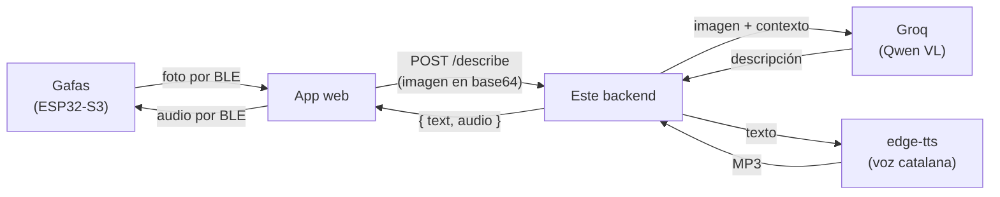

# Bonsai Backend

Backend de **Bonsai**, unas gafas inteligentes que cuentan en voz alta lo que
tienes delante: para orientarte, para leer un cartel o un menú, para saber qué
es un objeto o simplemente por curiosidad. Sirven igual a quien no ve bien que
a cualquiera que quiera preguntarle algo a lo que está mirando.

Este servidor concentra toda la inteligencia del sistema (visión, voz y
memoria) para que la ESP32 y la app web solo tengan que llamar a un endpoint
HTTP. El microcontrolador no habla con ninguna API de IA: solo saca la foto y
reproduce el audio.



En cada petición el servidor añade al prompt la fecha de hoy y los recuerdos
guardados de ese dispositivo, para que las descripciones tengan contexto.

Las respuestas son **de 1 o 2 frases** a propósito: todo lo que dice el modelo
hay que escucharlo después, así que cada frase de más son segundos de espera.
Si necesitas más detalle, se pide con el campo `prompt`.

- **Visión**: Groq con un modelo Qwen VL (~1-2 s).
- **Voz**: edge-tts, las voces neuronales de Microsoft, gratuitas y con
  **catalán** (`ca-ES-JoanaNeural` por defecto).
- **Memoria**: SQLite, un fichero, sin servicios externos.
- **Idiomas**: `ca` (por defecto), `es`, `en`.

---

## Índice

1. [Probarlo en tu ordenador](#1-probarlo-en-tu-ordenador)
2. [Terminal de pruebas](#2-terminal-de-pruebas)
3. [API](#3-api)
4. [Desplegarlo en una VPS](#4-desplegarlo-en-una-vps)
5. [Usarlo desde la app web o la ESP32](#5-usarlo-desde-la-app-web-o-la-esp32)
6. [Variables de entorno](#6-variables-de-entorno)
7. [Notas técnicas](#7-notas-técnicas)

---

## 1. Probarlo en tu ordenador

No hace falta Docker ni servidor: funciona entero en local. Solo necesitas
**Python 3.11 o superior** y una API key gratuita de
[console.groq.com](https://console.groq.com).

### Windows (PowerShell)

```powershell
git clone https://github.com/devvazquez/bonsai-backend.git
cd bonsai-backend
.\run-local.ps1
```

La primera vez el script crea el `.env` y se para para que pongas tu
`GROQ_API_KEY` dentro. Lo vuelves a ejecutar y ya arranca.

> Si PowerShell se queja de que no puede ejecutar scripts:
> `Set-ExecutionPolicy -Scope CurrentUser RemoteSigned`

### Linux / macOS

```bash
git clone https://github.com/devvazquez/bonsai-backend.git
cd bonsai-backend
chmod +x run-local.sh
./run-local.sh
```

El script se encarga de todo: crea el entorno virtual, instala las
dependencias, carga el `.env` y levanta el servidor con recarga automática
(al guardar un `.py`, se reinicia solo).

Cuando esté en marcha:

- API: <http://127.0.0.1:8080>
- Documentación interactiva (Swagger, se puede probar desde el navegador):
  <http://127.0.0.1:8080/docs>
- Comprobación rápida: <http://127.0.0.1:8080/health> debe devolver
  `{"ok":true,"groqKeyConfigured":true,...}`

En local no hace falta token (`BONSAI_API_TOKEN` vacío). La base de datos de
los recuerdos se crea en `./data/bonsai.db`.

<details>
<summary>Arrancarlo a mano, sin el script</summary>

```bash
python -m venv .venv
.venv/Scripts/activate        # Windows:  .venv\Scripts\Activate.ps1
pip install -r requirements.txt
cp .env.example .env          # y pon dentro tu GROQ_API_KEY
uvicorn main:app --host 127.0.0.1 --port 8080 --reload
```

En Linux/macOS, `source .venv/bin/activate`. Con este método hay que exportar
las variables del `.env` a mano (`set -a; . ./.env; set +a`).
</details>

---

## 2. Terminal de pruebas

`test_bonsai.py` es una consola interactiva para probarlo todo sin escribir
código. No necesita dependencias (solo la librería estándar), así que se puede
lanzar con el Python del sistema, en **otra terminal** mientras el servidor
está en marcha:

```bash
python test_bonsai.py
```

```
bonsai> health                          # ¿responde el servidor?
bonsai> voices ca                       # voces catalanas disponibles
bonsai> speak Hola Biel, les ulleres funcionen
bonsai> remember Al Biel li agrada el cafè sense sucre
bonsai> memories
bonsai> describe image.png              # la prueba completa: imagen -> texto -> audio
bonsai> config url https://bonsai.tudominio.com   # apuntar a la VPS
bonsai> config token el-token-de-la-vps
bonsai> help
```

`describe` guarda el MP3 en la carpeta actual, lo abre con el reproductor por
defecto y muestra el desglose de tiempos: cuánto tarda en codificar la imagen,
la visión, el TTS y la ida y vuelta completa.

El repositorio incluye una `image.png` de ejemplo para probar sin buscar fotos.

---

## 3. API

| Método | Ruta | Descripción |
| --- | --- | --- |
| `POST` | `/describe` | El endpoint principal: imagen → texto + audio (JSON, para navegadores) |
| `POST` | `/look` | Lo mismo para la ESP32: audio en crudo y en streaming, listo para el I2S |
| `POST` | `/speak?text=...&lang=ca` | Solo texto a voz. Devuelve el MP3 en crudo |
| `POST` | `/memory` | `{deviceId, fact}` — guarda un recuerdo |
| `GET` | `/memory/{deviceId}` | Lista los recuerdos del dispositivo |
| `DELETE` | `/memory/{deviceId}/{id}` | Borra un recuerdo (vale el prefijo del id) |
| `GET` | `/voices?prefix=ca` | Voces disponibles para un idioma |
| `GET` | `/health` | Estado del servicio. **Sin autenticación** |

### `POST /describe`

```jsonc
{
  "image": "<base64 sin el prefijo data:image/...>",
  "deviceId": "bonsai-01",
  "prompt": "¿Qué dice el cartel?",   // opcional; por defecto, descripción general
  "lang": "ca",                        // opcional: ca | es | en
  "voice": "ca-ES-EnricNeural",        // opcional: fuerza una voz concreta
  "audio": true,                       // a false devuelve solo texto (mucho más rápido)
  "provider": "gemini",                // opcional: gemini | groq. Por defecto, VISION_PROVIDER
  "tts": "piper"                       // opcional: piper | edge. Por defecto, TTS_PROVIDER
}
```

Respuesta:

```jsonc
{
  "text": "Estàs en una plaça empedrada amb edificis antics i llums de carrer enceses. Hi ha gent passejant i terrasses de cafès al fons.",
  "lang": "ca",
  "provider": "gemini",
  "model": "gemini-3.1-flash-lite",
  "audio": "<audio en base64>",
  "audioFormat": "wav",                // wav con Piper, mp3 con edge-tts: no lo des por hecho
  "tts": "piper",
  "voice": "ca_ES-upc_ona-medium",
  "timings": { "memoria_ms": 0, "vision_ms": 784, "tts_ms": 362 }
}
```

`timings` viene en todas las respuestas: es la forma rápida de ver en qué
etapa se va el tiempo sin tocar los logs.

### Elegir el proveedor de visión

Hay dos, con la misma interfaz, y se puede cambiar por petición con el campo
`provider` sin reiniciar nada:

| Proveedor | Modelo por defecto | Capa gratuita | Para qué |
| --- | --- | --- | --- |
| `gemini` (por defecto) | `gemini-3.1-flash-lite` | 250.000 tokens/min, 1.500 peticiones/día | El del día a día: la cuota da para desarrollar de verdad |
| `groq` | `qwen/qwen3.6-27b` | 8.000 tokens/min, 200.000 tokens/día | Más rápido, pero la cuota se agota en unas pocas fotos sin reducir |

El límite de Groq es **por organización, no por API key**: crear una key nueva
no reinicia el contador.

Y un aviso que no es técnico: en la **capa gratuita** de Google, Google entrena
con lo que le mandas (*"Google uses the content you submit to the Services and
any generated responses to provide, improve, and develop Google products"*). En
la de pago, no. Para unas gafas que fotografían la calle y a la gente que pasa,
eso cuenta.

`GET /health` dice en todo momento cuál es el proveedor por defecto, qué modelo
usa cada uno y si su key está configurada.

### Elegir el motor de voz

Igual que con la visión, hay dos y se cambia por petición con el campo `tts`:

| Motor | Voz por defecto (ca) | Latencia medida | Formato | Notas |
| --- | --- | --- | --- | --- |
| `piper` (por defecto) | `ca_ES-upc_ona-medium` | **205 ms** (182-422) | WAV | En local, sin red ni cuota |
| `edge` | `ca-ES-JoanaNeural` | 1.320 ms (949-2.089) | MP3 | Mejor calidad de voz |

En una petición completa con foto, el cambio se nota: **1.170 ms con Piper
frente a 2.575 ms con edge-tts**, con la misma imagen y el mismo modelo de
visión.

Dos cosas a tener en cuenta:

- **El formato cambia.** Piper devuelve WAV y edge-tts, MP3. La respuesta lo
  dice en `audioFormat` y `/speak` en el `Content-Type`; no lo des por hecho.
  El WAV pesa bastante más (247 KB frente a 66 KB en la misma frase), que
  importa por BLE y con datos móviles.
- **La voz de Piper suena más robótica.** Es un modelo VITS, no una voz
  neuronal de Azure. Si prefieres la calidad a la latencia, `TTS_PROVIDER=edge`.

Los modelos de Piper (63 MB para `upc_ona` medium) **se bajan solos la primera
vez que arranca el servidor** y quedan en `voices/`. Para tenerlos antes, por
ejemplo al construir la imagen de Docker:

```sh
python descargar_voces.py            # la de por defecto (catalán)
python descargar_voces.py --todas
```

Si Piper no está disponible (falta el modelo, o la librería), el servidor
**no se queda mudo**: usa edge-tts y lo dice en `/health`, en
`tts.active` y `tts.piper.error`. El apaño es visible a propósito.

### Errores de `/describe`

| Código | Significa | Qué hacer |
| --- | --- | --- |
| `429` | Cuota del proveedor agotada | Esperar y reintentar. Viene con la cabecera `Retry-After` en segundos, sacada de la respuesta del proveedor |
| `502` | El proveedor o edge-tts han fallado de verdad | Mirar los logs; el detalle del error va en el cuerpo, con el tipo de excepción |
| `500` | Falta la key del proveedor elegido | Revisar el `.env` |
| `400` | `provider` no es `gemini` ni `groq` | Corregir la petición |

Conviene que la app distinga el `429`: no es un fallo, solo hay que esperar
los segundos que diga `Retry-After` y volver a intentarlo, sin dar error a la
persona que lleva las gafas.

### Autenticación

Todos los endpoints salvo `/health` piden la cabecera:

```
X-API-Token: <tu-token>
```

Se activa definiendo `BONSAI_API_TOKEN`. Si se deja vacío, no se exige nada:
cómodo en local, **desaconsejado en un servidor público** — sin token,
cualquiera que descubra la URL puede gastar la cuota de Groq.

---

## 4. Desplegarlo en una VPS

Esta es la parte del despliegue en el servidor. Va con Docker, así que no hay
que instalar Python ni dependencias en la máquina.

### Requisitos

- Acceso SSH a la VPS.
- **Docker** y **Docker Compose** instalados.
- Un subdominio con un registro `A` apuntando a la IP de la VPS
  (p. ej. `bonsai.tudominio.com`).
- Puertos **80** y **443** abiertos, solo si se usa el Caddy incluido.
- Saber si **ya hay otro proxy inverso** en la máquina (Nginx, Traefik,
  Apache...): eso decide entre la opción A y la B de más abajo.

### 4.1. Clonar y configurar

```bash
git clone https://github.com/devvazquez/bonsai-backend.git
cd bonsai-backend
cp .env.example .env
openssl rand -hex 32        # genera un token seguro; cópialo
nano .env
```

```ini
GROQ_API_KEY=gsk_la_clave_real_de_groq
BONSAI_API_TOKEN=el-token-que-acabas-de-generar
BONSAI_DOMAIN=bonsai.tudominio.com
ALLOWED_ORIGINS=https://la-app-web-de-bonsai.com
```

El `.env` **nunca** se sube al repositorio (está en `.gitignore`).

### 4.2. Arrancar

#### Opción A — la VPS no tiene ningún proxy (lo más sencillo)

Levanta la app y un Caddy que gestiona el HTTPS solo, incluidos los
certificados de Let's Encrypt y sus renovaciones:

```bash
docker compose --profile caddy up -d --build
```

El DNS tiene que apuntar ya a la VPS **antes** de arrancar: Caddy pide el
certificado nada más levantarse.

#### Opción B — la VPS ya tiene Nginx u otro proxy

Levanta solo la aplicación, que escucha en `127.0.0.1:8080` sin exponerse a
internet:

```bash
docker compose up -d --build
```

Y se añade al proxy que ya existe algo equivalente a esto (Nginx):

```nginx
server {
    server_name bonsai.tudominio.com;

    client_max_body_size 12M;    # las imágenes en base64 ocupan

    location / {
        proxy_pass http://127.0.0.1:8080;
        proxy_set_header Host $host;
        proxy_set_header X-Real-IP $remote_addr;
        proxy_read_timeout 60s;  # visión + TTS puede tardar unos segundos
    }
}
```

Después, `certbot --nginx -d bonsai.tudominio.com` para el HTTPS.

### 4.3. Comprobar que va

```bash
docker compose ps            # el contenedor debe aparecer como "healthy"
docker compose logs -f       # logs en vivo
curl http://localhost:8080/health
```

Tiene que responder:

```json
{"ok":true,"groqKeyConfigured":true,"authRequired":true}
```

Si `groqKeyConfigured` sale `false`, la clave no ha llegado al contenedor:
revisa el `.env` y reinicia. Desde fuera, `curl https://bonsai.tudominio.com/health`.

La prueba de verdad es desde tu ordenador, con la terminal de pruebas
(sección 2): `config url https://bonsai.tudominio.com`, `config token ...`,
y luego `describe foto.jpg`.

### 4.4. Día a día

```bash
# Actualizar cuando haya cambios en el código
git pull && docker compose up -d --build

# Reiniciar / parar (los recuerdos sobreviven: están en un volumen)
docker compose restart
docker compose down

# Logs
docker compose logs -f bonsai

# Copia de seguridad de los recuerdos
docker compose cp bonsai:/data/bonsai.db ./backup-$(date +%F).db
```

**Consumo**: es un contenedor Python que casi todo el tiempo está esperando a
Groq. Con ~256 MB de RAM va sobrado y no usa GPU: toda la IA es remota.

---

## 5. Usarlo desde la app web o la ESP32

```javascript
const resp = await fetch("https://bonsai.tudominio.com/describe", {
  method: "POST",
  headers: {
    "Content-Type": "application/json",
    "X-API-Token": "el-token-de-la-vps",
  },
  body: JSON.stringify({
    deviceId: "bonsai-01",
    image: imagenEnBase64,   // sin el prefijo "data:image/jpeg;base64,"
    lang: "ca",
  }),
});

const { text, audio } = await resp.json();
// audio es un MP3 en base64: listo para reproducir o mandar por BLE
new Audio("data:audio/mpeg;base64," + audio).play();
```

### Para la ESP32-S3: `POST /look`

`/describe` está pensado para navegadores: devuelve JSON con el audio en
base64, que es un 33 % más de bytes y obliga a decodificar en el
microcontrolador. Para el ESP32-S3 con un MAX98357A está `/look`, que hace lo
mismo en **una sola petición** pero devolviendo el audio en crudo y **en
streaming**.

```jsonc
POST /look
{
  "image": "<base64>", "deviceId": "bonsai-01", "lang": "ca",
  "audioFormat": "pcm16",   // pcm16 | mulaw | wav. Por defecto pcm16
  "sampleRate": 16000       // 8000 | 16000 | 22050. Por defecto, el de la voz
}
```

El cuerpo son las muestras tal cual: con `pcm16` son enteros de 16 bits con
signo, little-endian, mono, que es exactamente lo que quiere el I2S del
MAX98357A. Se escriben con `i2s_write()` sin cabecera, sin códec y sin
conversión. El texto y los parámetros del audio van en cabeceras, para que el
firmware no tenga que adivinar cómo configurar el I2S:

```
X-Bonsai-Text: <el texto, UTF-8 en base64>
X-Bonsai-Format: pcm16     X-Bonsai-Rate: 16000
X-Bonsai-Bits: 16          X-Bonsai-Channels: 1
```

**Por qué el streaming cambia las cuentas.** Medido, el primer byte de audio
sale a los **1.024-1.463 ms** (casi todo es la visión). A partir de ahí el
audio llega más rápido de lo que se escucha, así que la descarga **se solapa
con la reproducción y deja de sumar latencia**: solo tiene que ir más rápido
que el tiempo real.

| Formato | Tamaño (frase de ~8 s) | Ritmo en tiempo real | Margen a 150 KB/s |
| --- | --- | --- | --- |
| `pcm16` 22050 Hz | 370 KB | 44,1 KB/s | 3,4x |
| `pcm16` 16000 Hz | 237 KB | 32,0 KB/s | 4,7x |
| `mulaw` 16000 Hz | 131 KB | 16,0 KB/s | 9,4x |
| `mulaw` 8000 Hz | 65 KB | 8,0 KB/s | 19x |

`pcm16` a 16 kHz es el equilibrio razonable: nada que descodificar y margen de
sobra. `mulaw` se expande en el ESP32 con una tabla de 256 entradas (una suma
y un desplazamiento por muestra) y es lo que conviene si el WiFi va justo, a
costa de calidad. `wav` es solo para navegadores: lleva cabecera con las
longitudes a 0xFFFFFFFF porque al empezar a responder aún no se sabe cuánto
audio habrá.

`/look` exige Piper (devuelve un 400 con `"tts": "edge"`): edge-tts da MP3 y
la idea es justamente no tener que descodificar nada.

Para solo texto a voz sigue estando `/speak`, que también devuelve el audio en
crudo.

---

## 6. Variables de entorno

| Variable | Por defecto | Para qué sirve |
| --- | --- | --- |
| `VISION_PROVIDER` | `gemini` | Proveedor de visión por defecto: `gemini` o `groq` |
| `GEMINI_API_KEY` | — | **Obligatoria** con el proveedor por defecto. Clave de [aistudio.google.com/apikey](https://aistudio.google.com/apikey) |
| `GROQ_API_KEY` | — | Obligatoria solo si usas `groq`. Clave de [console.groq.com](https://console.groq.com) |
| `BONSAI_API_TOKEN` | vacío | Protege la API. Vacío = sin autenticación |
| `ALLOWED_ORIGINS` | `*` | Orígenes CORS permitidos, separados por comas |
| `GEMINI_VISION_MODEL` | `gemini-3.1-flash-lite` | Modelo de Gemini. Más calidad: `gemini-3.5-flash` |
| `GEMINI_THINKING_LEVEL` | `minimal` | Razonamiento de Gemini. Subirlo trunca la respuesta: gasta los 150 tokens pensando |
| `GEMINI_MEDIA_RESOLUTION` | (el de la API) | `LOW`, `MEDIUM` o `HIGH`. Es lo que decide el coste de la imagen en Gemini, no su tamaño |
| `GROQ_VISION_MODEL` | `qwen/qwen3.6-27b` | Modelo de visión, por si Groq lo renombra |
| `TTS_PROVIDER` | `piper` | Motor de voz por defecto: `piper` (local, rápido) o `edge` (Microsoft, mejor voz) |
| `PIPER_VOICES_DIR` | `./voices` | Dónde viven los modelos `.onnx` de Piper |
| `BONSAI_DB_PATH` | `/data/bonsai.db` o `./data/bonsai.db` | Ruta de la base de datos de recuerdos |
| `BONSAI_DOMAIN` | — | Dominio para el HTTPS automático (solo con el perfil `caddy`) |
| `PORT` | `8080` | Puerto dentro del contenedor |

---

## 7. Notas técnicas

### Estructura

| Fichero | Contenido |
| --- | --- |
| `main.py` | La API: endpoints, autenticación, construcción del prompt |
| `vision.py` | Lo común a los proveedores: cliente HTTP, cuota agotada, formato de imagen |
| `gemini_vision.py` | Cliente de Gemini (el proveedor por defecto) |
| `groq_vision.py` | Cliente de Groq |
| `tts.py` | Capa común de voz: elige motor, voz por idioma y formato |
| `piper_tts.py` | Voz en local con Piper (el motor por defecto) |
| `memory.py` | Recuerdos por dispositivo en SQLite |
| `static/probar.html` | Página de prueba para el móvil, en `/probar` |
| `test_bonsai.py` | Terminal de pruebas, sin dependencias |
| `bench_latency.py` | Banco de pruebas de latencia, con tope de cuota |
| `descargar_voces.py` | Baja los modelos de Piper a `voices/` |
| `Dockerfile`, `docker-compose.yml`, `Caddyfile` | Despliegue |
| `run-local.ps1`, `run-local.sh` | Desarrollo en local sin Docker |

### Por qué Python y no Cloudflare Workers

La primera versión de este backend estaba en Cloudflare Workers. El requisito
del **catalán** obliga a usar edge-tts, que necesita un WebSocket con
cabeceras propias sobre un socket TCP real: algo que Workers no permite.

| Intento | Resultado |
| --- | --- |
| edge-tts a mano en Workers (fetch + Upgrade) | Microsoft devuelve cientos de frames binarios vacíos |
| npm `edge-tts-universal` en Workers | `ws` no funciona ahí → WebSocket sin cabeceras → 403 |
| Workers AI (`melotts`) | Funciona, pero no tiene catalán |
| Groq TTS | Solo inglés y árabe |
| **edge-tts en Python** | ✅ Funciona, con catalán |

De ahí que ahora sea un contenedor Python en una VPS.

### Latencia: dónde se va el tiempo

Todo lo de abajo está medido, no estimado. Cada respuesta trae su `timings`
para poder repetir las mediciones.

| Etapa | Tiempo | Comentario |
| --- | --- | --- |
| Subir la imagen + red hasta el proveedor | ~0,7 s | Depende de tu conexión de subida |
| Visión, Gemini `3.1-flash-lite` | **0,84-1,25 s** | Medido de extremo a extremo, incluida la red |
| Visión, Groq `qwen3.6-27b` | 1,07 s con la imagen a 896 px | 2,4-3,8 s sin reducirla |
| edge-tts, texto nuevo | 0,95-2,1 s (mediana 1,32 s) | **Es el cuello de botella.** Ver la trampa de la caché, más abajo |
| Escuchar el audio | ~10 s | 1-2 frases. Es el tramo más largo de todos |

En una petición completa medida (`/describe` con audio, en catalán): visión
838 ms, TTS 4.336 ms. Ese 4,3 s es la cola mala del TTS (primera conexión);
en régimen la mediana es 1,32 s. Aun así el TTS es la etapa más lenta con
diferencia: acortar el texto o empezar a reproducir antes rinde mucho más que
acelerar la visión.

#### La trampa al medir edge-tts: Microsoft cachea por texto y voz

**Cualquier medición que repita la misma frase es falsa**, y es fácil caer sin
darse cuenta: basta haber sintetizado ese texto en una prueba anterior, porque
la caché es del servidor de Microsoft y sobrevive entre ejecuciones. Medido con
8 frases catalanas nuevas, cada una una sola vez, y luego las mismas 8 otra vez:

| | Primer trozo | Audio completo |
| --- | --- | --- |
| Texto nuevo (lo que pasa en uso real) | mediana **1.092 ms**, hasta 1.864 | mediana **1.320 ms**, hasta 2.089 |
| Texto repetido (caché) | mediana 262 ms | mediana 430 ms |

Son **3,1 veces** de diferencia. En las gafas el texto es siempre nuevo, así que
la columna que cuenta es la primera. Las demos de edge-tts que presumen de
0,4 s están midiendo la caché.

#### Alternativa evaluada: Piper (local)

[Piper](https://github.com/rhasspy/piper) tiene dos voces catalanas de la UPC
(`upc_ona`, `upc_pau`) y sintetiza **en local**, sin red. Medido con la misma
frase, y aquí no hay caché que engañe porque cada síntesis se hace de cero:

| | Mediana | Rango | Notas |
| --- | --- | --- | --- |
| `upc_ona` medium, 22 kHz | **205 ms** | 182-422 | Modelo de 63 MB |
| `upc_pau` x_low, 16 kHz | **122 ms** | 105-219 | Modelo de 28 MB |
| edge-tts, texto nuevo, 24 kHz | 1.320 ms | 949-2.089 | Depende de Microsoft |

Es **6,4 veces más rápido** que edge-tts con texto nuevo, y sobre todo
predecible: sin red, sin cola larga y sin depender de un servicio ajeno. El
modelo tarda ~1,2 s en cargarse una sola vez al arrancar.

La contrapartida es la calidad de voz: son modelos VITS y suenan más robóticos
que las voces neuronales de Azure. **Ya está decidido: se usa `upc_ona`
medium**, y `TTS_PROVIDER=edge` sigue disponible para quien prefiera la voz de
Microsoft.

#### Descartado: el TTS de Gemini

Soporta catalán, pero medido con la misma frase es **inservible para esto**:

| Modelo | Latencia |
| --- | --- |
| `gemini-2.5-flash-preview-tts` | 5.354 ms y 7.727 ms |
| `gemini-3.1-flash-tts-preview` | 11.320 ms |

Entre 4 y 55 veces más lento que Piper, y encima gastando de la misma cuota que
la visión. La calidad de voz es buena, pero no a ese precio en latencia.

**El streaming de visión no compensa.** Medido con `--mode ttft`: el primer
token de Gemini llega a los 1.246 ms y la respuesta completa a los 1.303 ms, es
decir **57 ms de diferencia** en 3 trozos. El modelo escribe la frase corta de
golpe, así que mandarla al TTS a trozos no ahorra nada apreciable. Donde sí se
gana es en `/speak`, que ya va por trozos.

#### Reducir la imagen: depende del proveedor (corrección)

Aquí decía antes, sin matizar, que reducir la imagen no bajaba el coste.
Resulta que **cada proveedor cobra de forma distinta**, así que la respuesta no
es la misma para los dos. Ambas cosas están medidas:

**Groq cobra por píxeles**, así que reducir es la diferencia entre poder probar
y no poder:

| Imagen | Tamaño | Latencia de visión | Tokens de entrada |
| --- | --- | --- | --- |
| 3024x4032 (foto de móvil) | 3,1 MB | 2,4-3,8 s | ~50.000 |
| 672x896 (lado largo 896 px) | 64 KB | **1,07-1,16 s** | **2.656** |

Los 2.656 no son estimación: los dijo el propio error 429 de Groq
(`Requested 2656`). Con la foto sin reducir se agotaron los 200.000 tokens del
día en unas seis peticiones.

**Gemini cobra plano.** Medido con su endpoint `countTokens`, que es gratis: la
misma foto cuesta **1.108 tokens tanto a 256x170 como a 2400x1597**. Reducirla
no ahorra ni un token. Lo que cambia el precio es `mediaResolution`:

| `mediaResolution` | Tokens | Resultado con la foto de prueba |
| --- | --- | --- |
| `LOW` | 286 | Confundió la plaza (dijo otra ciudad) |
| `MEDIUM` | 577 | Misma respuesta que `HIGH` |
| sin especificar (= `HIGH`) | 1.133 | Correcta |

Se deja el valor por defecto de la API. `MEDIUM` dobla las pruebas que caben en
la cuota y en esta foto acertó igual, pero es una sola foto: si lo bajas,
compruébalo con las tuyas. Con `LOW` ya se vio perder precisión, y esto son unas
gafas para orientarse.

Así que reducir la imagen sigue mereciendo la pena, pero por otras dos razones
que valen para los dos proveedores: se sube antes (importa con datos móviles y
por BLE desde la ESP32) y en Groq baja la latencia de visión a un tercio.
Reducir en el servidor cuesta ~200 ms de CPU con Pillow para una foto de 12 MP.
Está pendiente de hacer: hoy depende de que el cliente se acuerde.

Cosas comprobadas que **no** ayudan, para no perder el tiempo con ellas:

- **Partir el texto en frases y sintetizarlas en paralelo sale peor** (ver
  abajo).
- **En Groq no hay alternativa de modelo de visión**: solo `qwen/qwen3.6-27b`;
  el resto de su catálogo es texto, transcripción o TTS. Para cambiar de modelo
  hay que cambiar de proveedor, que es justo lo que permite el campo
  `provider`.
- **Partir el texto en frases y sintetizarlas en paralelo sale peor**: cada
  frase abre su propio WebSocket con Microsoft (~1,5 s), y compitiendo entre
  ellas el primer audio llegaba a los 2,4-5,6 s en vez de 1,5-2,0 s.

Cosas que sí ayudan y ya están hechas:

- **Nada de razonamiento paso a paso, en los dos proveedores.**
  `reasoning_effort: "none"` en `groq_vision.py` no es decorativo: sin él el
  modelo escribe un bloque `<think>` que se come los 150 tokens y devuelve la
  respuesta truncada (medido: 2,28 s y respuesta inservible, contra 1,26 s y
  respuesta correcta).

  En Gemini pasa exactamente lo mismo y por eso va
  `thinkingConfig: {thinkingLevel: "minimal"}`. Medido con `thinkingLevel:
  "medium"`: gasta ~140 tokens pensando, agota los 150 de `maxOutputTokens` y
  devuelve `finishReason: MAX_TOKENS` con la frase cortada a media palabra
  («Tienes delante la Plaça de»). Con `minimal`: 0 tokens de pensamiento,
  respuesta completa y 838 ms de visión en vez de 1.107-1.226 ms.

  Cuidado con el sitio exacto del campo: `thinkingLevel` suelto en
  `generationConfig` lo rechaza con un 400 («Unknown name "thinkingLevel"»).
  Tiene que ir anidado en `thinkingConfig`.
- **Una sola conexión con el proveedor** para todo el proceso, en vez de abrir
  una por foto: el handshake TLS son ~220 ms medidos que ahora se pagan una vez.
  Además se abre al arrancar (`vision.warmup()`), así que ni siquiera los paga
  la primera persona que use las gafas. El calentamiento pide un listado de
  modelos: no gasta ni un token.
- **Respuestas de 1 o 2 frases** (prompt + `max_completion_tokens: 150`):
  acorta las dos etapas que escalan con la longitud. Medido con la misma foto,
  pasar de 49 a 23 palabras baja la locución de ~21 s a ~10 s.
- **`/speak` va por trozos**, así que se puede empezar a reproducir en cuanto
  llega el primero en vez de esperar el MP3 entero (~1,3 s menos de espera).

**El camino más rápido** si la app quiere reaccionar cuanto antes: pedir
`/describe` con `"audio": false` (texto en ~0,9 s, se puede mostrar ya) y a
continuación `/speak` con ese texto, que va llegando a trozos. Así no se espera
a tener todo el audio generado antes de empezar a oír algo.

#### Medirlo tú mismo: `bench_latency.py`

Mide el desglose (reducir, codificar, red, visión, TTS) y **por defecto no gasta
cuota**: enseña cuántas peticiones haría y cuántos tokens costaría, y no llama a
nadie hasta que se lo confirmas con `--yes`.

```sh
# 0 tokens: comprueba el código (formato de imagen, 429, payloads, errores)
python bench_latency.py --selftest

# 0 tokens: ensayo, dice lo que costaría
python bench_latency.py --provider both --image foto.jpg

# Gasta cuota: lo mínimo para tener el dato
python bench_latency.py --provider gemini --image foto.jpg --only-small --yes

# Compara proveedores con la misma foto
python bench_latency.py --provider both --image foto.jpg --sizes 896 --yes

# Time to first token: ¿merece la pena mandar el texto al TTS a trozos?
python bench_latency.py --provider gemini --image foto.jpg --mode ttft --yes
```

Se para en cuanto ve un 429, para no insistir contra una cuota agotada, y aborta
antes de empezar si el plan pasa de `--budget` (20.000 tokens por defecto).
Necesita Pillow (`pip install pillow`) para las variantes reducidas; sin él mide
solo la imagen original.

El modo `ttft` es el que dice si queda latencia por ganar: si el primer token
llega mucho antes de que termine la frase, conviene ir mandando el texto al TTS
a medida que llega en vez de esperar la respuesta completa.

(La trampa de la caché de edge-tts está medida más arriba: 430 ms con texto
repetido frente a 1.320 ms con texto nuevo.)

### Otros apuntes

- **Modelo de Groq**: Groq renombra y retira modelos con frecuencia. Si
  `/describe` empieza a dar error 502, comprueba el nombre vigente en
  <https://console.groq.com/docs/models> y cámbialo con `GROQ_VISION_MODEL`,
  sin tocar el código.
- **Límites del plan gratuito de Groq**: cada foto gasta ~1.800 tokens, y el
  plan da 8.000 tokens por minuto y 200.000 al día. Salen unas **4 fotos por
  minuto y ~110 al día**. Como el coste por imagen es fijo, mandarla más pequeña
  no da más margen: si las gafas se van a usar de verdad a diario, hace falta el
  plan de pago.
- **edge-tts** usa un protocolo que Microsoft no documenta oficialmente (el
  mismo que la librería de Python homónima, muy usada y mantenida). Funciona
  bien, pero conviene saber que podría romperse si Microsoft lo cambiara.
- **Memoria**: por ahora solo guarda lo que se le manda explícitamente a
  `POST /memory`. El siguiente paso natural sería pedirle al modelo que
  devuelva un campo `{"remember": "..."}` y guardarlo solo.
- **Límite de recuerdos**: 50 por dispositivo (`MAX_ITEMS` en `memory.py`),
  para que el prompt no crezca sin control.
